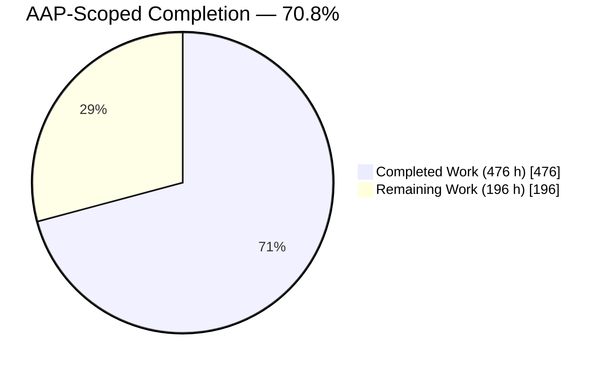
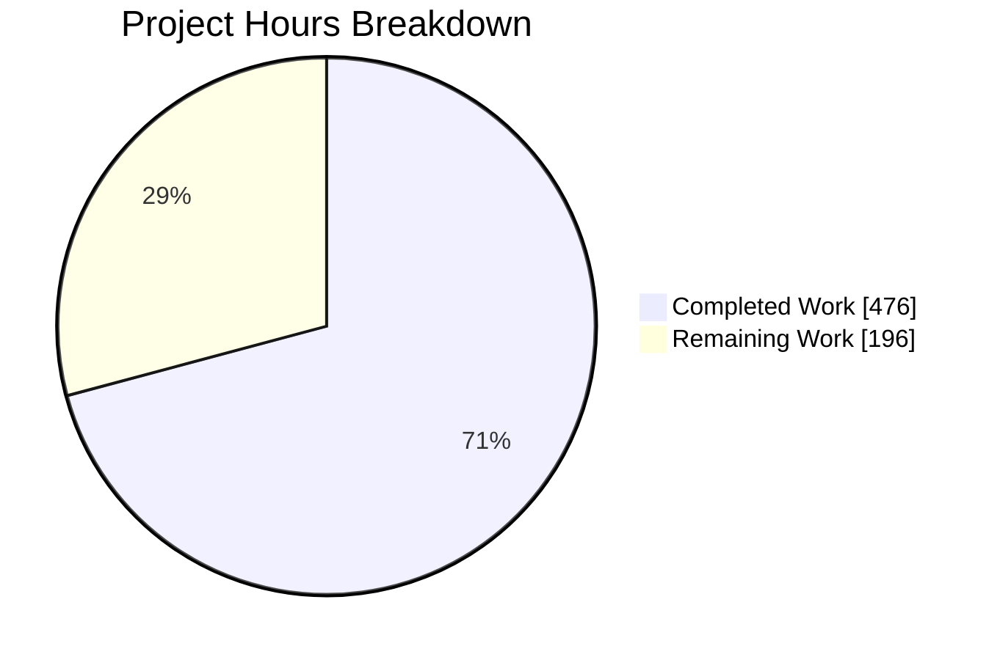
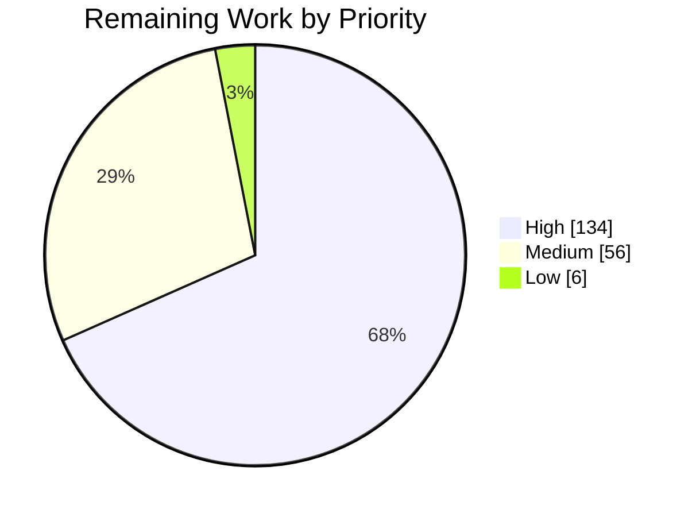

# 1. Executive Summary

## 1.1 Project Overview

The CICS/COBOL cash-account program over DB2 for z/OS and a VSAM history file is replaced by a cloud-native cash
ledger service at `backend/cash-account-modernized/` — Spring Boot 3.3.13 on Java 21 over PostgreSQL. It sits
behind the seam `backend/broker` already calls, so the retail contract is unchanged on the wire, and adds an
institutional reservation surface over available and reserved balances with an append-only, immediately queryable
ledger. Migration, reconciliation and dual-run tooling ships with it, proven on legacy-shaped fixtures, alongside
an operator runbook. No other module, chart template or legacy artifact is touched: cutover is a
deployment-values change.

## 1.2 Completion Status



Completed = Dark Blue `#5B39F3` · Remaining = White `#FFFFFF`

| Metric | Value |
|---|---|
| **Total Hours** | **672** — 476 completed + 196 remaining |
| Completed Hours (AI + Manual) | **476** (476 AI · 0 manual) |
| Remaining Hours | **196** |
| **Percent Complete** | **70.8%** — 476 ÷ 672 × 100 |

Every deliverable the plan asked to be built is complete and verified. The remaining hours are the plan's
operator-owned hand-offs and the decisions they depend on.

## 1.3 Key Accomplishments

- Retail contract preserved exactly, driven end to end through `backend/broker`'s own `CashAccountClient`.
- Institutional hold / settle / release with idempotent writes and an explicit reservation state machine.
- Append-only ledger, immutable against UPDATE, DELETE and TRUNCATE, queryable the instant a transaction commits.
- Money is `BigDecimal` scale 2 over `NUMERIC(9,2)` — no floating point on any money path.
- Legacy behaviour characterized from the COBOL source, each improvement recorded against what it replaces.
- Migration and dual-run tooling reproduces the legacy arithmetic and flags every seeded discrepancy, on fixtures only.
- Estate JWT validated unchanged, with the `StockTrader` / `StockViewer` split and a `denyAll` default.
- Deployment shape conforms to the chart as it stands — port, probes, scrape and injected variables.

## 1.4 Critical Unresolved Issues

**18 of 28** scoped requirements and hand-offs carry something open — none a defect in delivered behaviour. Five
are runbook steps the plan hands off; twelve are decisions owned outside this codebase; one is a set of
controlled exposures.

| Issue | Impact | Owner | ETA |
|---|---|---|---|
| Runbook Steps 0–4, none executed — prerequisites and sign-offs, bulk migration rehearsal, shadow dual-run, controlled cutover, decommission — **5 items** | Live migration correctness is unproven off fixtures, and broker does not yet route to this service | Platform operator + data owner | 4–6 weeks |
| Six recorded deviations from the plan's frozen inventories await authorization — dependency pins, base image, error vocabulary, wrapper checksum, test volume, ignore file — **1 item** | Governance record incomplete. Every change they name is a security hardening or a behaviour guard that must not be reverted | Requesting organization | 1 week |
| Spring Boot 3.3 is past open-source end of life, and three advisories — one an actuator authentication bypass at CVSS 8.1 — sit in artifacts no build property can move — **1 item** | Release gate. A structural control makes them unreachable today; a control is not a patch | Platform owner + security | 2 weeks |
| Chart and platform controls this module may not set: an edge request-body cap, a second secret key for a DML-only database role, a readiness probe timeout, a network constraint over the actuator surface — **4 items** | Ledger immutability covers application paths only; request bytes are bounded in process but not at the network | Chart owners + platform owner | 2–3 weeks |
| Answers only the mainframe team or the data owner can give: five legacy characterization questions, the owner allowlist, the balance ceiling — **3 items** | Each is configuration rather than code, but the allowlist decides which legacy accounts load | Mainframe team + data owner | 2 weeks |
| Two written determinations with no basis in this repository, where defaulting one is prohibited: evidence handling and data retention — **2 items** | Step 0 cannot be signed off and Step 4 cannot begin | Risk / compliance | 2 weeks |
| Promotion pipeline: a CI workflow at promotion, a dependency-scan feed, and the SBOM decision — **1 item** | The build, scan and push path is documented but no image has been promoted | Platform operator | 2 weeks |
| Exposures carried with a stated control: six dependency lines above the framework's tested matrix, an unreachable `log4j-api` bridge advisory, PostgreSQL 12 past community end of life, two bulk-path owner sets linear in distinct owners, and TRACE refused without the standard error body — **1 item** | Bounded and measured; none reachable on a money path | Module owners | Backlog |

## 1.5 Access Issues

| System/Resource | Type of Access | Issue Description | Resolution Status | Owner |
|---|---|---|---|---|
| DB2 for z/OS `STOCKTRD.CASHACCOUNTY` / `STOCKTRD.FRANKFURT1` | Read-only credentials for `UNLOAD` | Not provisioned. Required before the migration rehearsal; the tooling is verified on fixtures only | Open — Step 1 precondition | Mainframe team |
| VSAM `SYSD.STOCK.HISTORY` | Read access for `IDCAMS REPRO` | Not provisioned, and the CICS FILE definition that settles the record length is unavailable | Open — Step 1 precondition | Mainframe team |
| CICS region configuration | FCT/CSD, region CCSID, time zone, `DROLLBACK` | Not available. Each is carried as a configurable property rather than a constant | Open | Mainframe team |
| Release values / StockTrader CR | `helm get values` / `kubectl get stocktrader` | Not captured. The pre-change snapshot is the rollback source for every later restore | Open — Step 0 precondition | Platform operator |
| Helm chart templates | Write access | Deliberately not held. Four outstanding controls need a template or values change and are routed to the chart owners | Open by design | Chart owners |
| Container registry | Push access for the promotion path | Not exercised. Build, scan, push and digest capture are documented; no image has been promoted | Open — Step 0 precondition | Platform operator |
| Dependency-scan feed | NVD API key or mirror | Not provisioned on any promotion runner, so the dependency scan has no feed | Open | Platform operator |
| OIDC identity provider | A reachable JWKS endpoint | No value exists in any environment reached so far, so `AUTH_TYPE=oidc` has been exercised only against a local TLS JWKS server | Open | Platform owner |

## 1.6 Recommended Next Steps

1. **[High]** Authorize the six recorded deviations and settle the Spring Boot framework line — the two release gates, neither needing code.
2. **[High]** Complete Step 0: release on PostgreSQL, image pushed with its digest recorded, values snapshot sealed, evidence-handling determination obtained.
3. **[High]** Confirm the owner allowlist and balance ceiling, then run Step 1's rehearsal to zero unresolved variance.
4. **[Medium]** Have the chart owners add the four outstanding controls: edge body cap, DML-only database identity, readiness probe timeout, actuator network constraint.
5. **[Medium]** Run Step 2's dual-run clean for the agreed windows, then Step 3's gated cutover with a rehearsed rollback.

# 2. Project Hours Breakdown

## 2.1 Completed Work Detail

| Component | Hours | Description |
|---|---|---|
| Legacy behaviour characterization | 20 | `docs/legacy-characterization.md` (723 lines): the six-code dispatcher, its DB2 and VSAM side effects, the fixed-point arithmetic, owner casing, the missing catch-all and the write-only audit file, each claim cited to a source line, with a disposition table for every behaviour preserved, changed or not replicated |
| Retail contract surface | 40 | `retail/` — the six seam operations with the legacy `A/Q/U/X/C/D` semantics, absolute-overwrite update, FX on credit and debit, and a ledger row per state change |
| Institutional reservation surface | 44 | `institutional/` — hold, settle (full, partial and zero), release, reservation and account views, the ledger query, incarnation-scoped idempotency with a canonical request hash, lazy and scheduled expiry |
| Money, owner and reservation domain model | 24 | `domain/` — `Money` at scale 2 with a single final truncation, owner normalization and bounds, the account and reservation entities, and the state machine that owns every legal transition and its balance effect |
| Relational schema and persistence layer | 36 | Seven tables with their constraints and indexes in a 281-line idempotent script applied at start-up and validated against the entities; seven repositories with account-first pessimistic locking and no ledger update or delete path |
| Immutable ledger and audit query surface | 16 | `audit/` — same-transaction append, ten event types, a wire DTO for the query, and database-level rejection of UPDATE, DELETE and TRUNCATE |
| Security: resource server, role model, four auth modes | 28 | `config/SecurityConfig`, `config/JwtDecoderConfig` — the estate's RS256 token validated unchanged, a closed `groups`-to-authority map, the `StockTrader` / `StockViewer` split with the parity grant, and `denyAll` outside the service's path space |
| Fail-closed error model | 24 | `error/` — one HTTP status per code, one payload shape rendered by the controller advice, the security entry point and access-denied handler, and the container and firewall edges |
| Exchange-rate integration | 24 | `fx/` — live lookup over a bounded, https-only transport with a whole-exchange deadline, one retry, a capped response body, a start-up warm-up, and a fixture-backed legacy-rate source confined to the tooling profile |
| Migration, reconciliation and dual-run tooling | 60 | `migration/` — the CLI runner with its exit-code contract, the delimited and IBM037 export readers, the single-transaction loader, the reconciler with its six variance kinds, and the shadow comparator that records every difference as a row |
| Legacy-shaped fixture data set | 16 | Matched and seeded-mismatch legacy exports including an EBCDIC history dump, shadow transaction streams, the rollback replay file and a recorded FX response, each directory carrying a provenance manifest |
| Automated test suite (152 tests) | 56 | 21 classes over unit, contract, institutional, audit, security, fail-closed, deployment-shape and migration concerns, against a Testcontainers PostgreSQL 12.22, with no mocking framework and verbatim copies of the caller's client under a drift check |
| Build, runtime configuration and container image | 24 | Spring Boot 3.3.13 / Java 21 build, a 465-line configuration mapping every injected variable to a property, the guarded datasource with its TLS assembly, the digest-pinned runtime image and the pinned Maven wrapper |
| Deployment-shape conformance | 16 | Port 8080 with no context path, all three chart probe paths answering at the root, the metrics scrape shim, and a cutover that needs only values |
| Operator documentation | 40 | `README.md` (1,811 lines) as the caller and operator contract with its open-items and authorization registers, and `docs/operational-runbook.md` (3,496 lines) covering Step 0 and Steps 1–4 with preconditions, actions, evidence, sign-offs and executable rollback |
| Documented build, scan and push promotion path | 8 | The verify → image build → scan → push → digest-capture sequence with a blocking gate, standing in for a CI workflow the umbrella repository cannot execute |
| **Total** | **476** | |

## 2.2 Remaining Work Detail

| Category | Hours | Priority |
|---|---|---|
| Runbook Step 0 — prerequisites, snapshots and sign-offs | 24 | High |
| Runbook Step 1 — bulk migration rehearsal and reconciliation against the real DB2 and VSAM | 36 | High |
| Runbook Step 2 — shadow dual-run over captured windows | 28 | High |
| Runbook Step 3 — controlled cutover and rehearsed rollback | 24 | High |
| Authorization of the six recorded deviations | 6 | High |
| Spring Boot framework-line and dependency-currency decision | 16 | High |
| Chart and platform controls — edge body cap, DML-only database identity, readiness probe timeout, actuator network constraint | 16 | Medium |
| Promotion pipeline — CI workflow, dependency-scan feed, SBOM decision | 16 | Medium |
| Mainframe and data-owner answers — characterization questions, owner allowlist, balance ceiling | 12 | Medium |
| Runbook Step 4 — decommission, blocked on the retention determination | 12 | Medium |
| Optional refinements and carried residuals | 6 | Low |
| **Total** | **196** | |

## 2.3 Hours Basis

Scope is the project plan and the path to production it implies; nothing outside that scope is counted.
Completed hours were assigned per deliverable from its implemented size and complexity — 17,194 lines of main
Java, 11,157 of test Java, 6,030 of documentation, a 281-line schema and 37,485 inserted lines across 135 files —
with testing weighted at roughly a third of development and the observed suite of 152 tests as the evidence that
those hours landed. Remaining hours are the plan's own hand-offs, estimated per runbook step from its
preconditions, actions, evidence and sign-offs, plus the authorization and platform decisions those steps depend
on. Confidence is high on the completed column, which is measured against a green gate and a verified tree, and
medium on Steps 1 and 2, whose effort scales with the real owner population and the number of dual-run windows
the organization requires.

**Total Project Hours = 476 completed + 196 remaining = 672.** Completion = 476 ÷ 672 × 100 = **70.8%**.

# 3. Test Results

One command is the whole gate: `cd backend/cash-account-modernized && ./mvnw -B clean verify`. It was executed
against the delivered tree for this assessment — **BUILD SUCCESS in 25.3 s, 152 tests, 0 failures, 0 errors,
0 skipped** (Surefire 57, Failsafe 95). Integration tests run against a disposable PostgreSQL 12.22 container,
the version the estate provisions, so every schema feature is proven at the compatibility floor. No coverage,
lint or enforcer plugin exists in this module or anywhere in the estate, so no coverage percentage is reported by
the tooling; the Coverage column below states what each area's tests actually reach.

| Area / Category | Framework | Tests | Passed | Failed | Coverage | What This Proves |
|---|---|---|---|---|---|---|
| Retail contract seam | JUnit 5 + MicroProfile REST Client (Failsafe) | 19 | 19 | 0 | All six caller operations, plus both copied caller files under a drift check | `backend/broker` can call this service unmodified and receive the wire shape it maps today, balance included as a plain decimal |
| Institutional reservations and audit immediacy | JUnit 5 + Testcontainers (Failsafe) | 24 | 24 | 0 | Every state transition, three two-thread races, replay after each terminal state | Funds can be held, settled in full or in part, and released with no double-spend under concurrency, and the audit row is readable on the very next call |
| Reservation and money domain rules | JUnit 5 (Surefire) | 23 | 23 | 0 | The state machine, `Money`, and owner normalization | Legacy fixed-point arithmetic is reproduced exactly, negative and out-of-range amounts are refused, and a held reservation always has a reachable terminal state |
| Security and role enforcement | JUnit 5 + Testcontainers (Failsafe) | 15 | 15 | 0 | Both role modes as separate contexts, token validity, authority mapping | Only the estate's own valid, time-bounded token reaches the service, reads and writes split by role, and anything outside the service's path space is denied |
| Fail-closed request handling | JUnit 5 + Testcontainers (Failsafe) | 12 | 12 | 0 | Unmapped paths and verbs, media-type and body-size refusals, field-level rejections | The legacy dispatcher's silent fall-through is gone: every unsupported request gets an explicit status and the one error payload shape |
| Migration, reconciliation and dual-run | JUnit 5 + Testcontainers (Failsafe / Surefire) | 30 | 30 | 0 | Loader, reconciler and comparator on matched and seeded fixtures, both export encodings, the rollback replay derivation, the characterization gate | Matched exports reconcile with zero variance, every seeded discrepancy is flagged and none is invented, and a load is all-or-nothing |
| Exchange rate and datasource configuration | JUnit 5 + `MockRestServiceServer` (Surefire) | 22 | 22 | 0 | Rate lookup and failure mapping, bean wiring by profile, both TLS URL shapes and the store guard | Conversion is exact and same-currency needs no call, a rate failure never moves money, and the service refuses to start against the wrong store or an unusable endpoint |
| Ledger immutability and deployment shape | JUnit 5 + Testcontainers (Failsafe) | 7 | 7 | 0 | UPDATE, DELETE and TRUNCATE rejection across a context restart; all three probe paths and both scrape paths | Audit history cannot be altered through any application route, and the pod satisfies the probes the chart already declares |
| **Total** | | **152** | **152** | **0** | | |

### Not Covered

These capabilities are delivered but are not exercised by any test in the suite. Each should be checked before
release.

- **`AUTH_TYPE=oidc` against a real identity provider.** The JWKS path is exercised only against a local TLS
  server; no environment reached so far carries a JWKS URL. Verify token acceptance and the role mapping against
  the actual provider.
- **`JDBC_SSL=true` with a chart-supplied trust certificate against a TLS PostgreSQL.** Only the assembled URL
  shapes are asserted, because no TLS database was available. Verify a real `verify-ca` connection.
- **`AUTH_TYPE=none`.** No test boots this mode. It disables authentication entirely and is documented as unfit
  for any shared environment; confirm it is never set outside local development.
- **The tooling CLI's own process contract for `reconcile` and `shadow-compare`.** The runner terminates the JVM,
  so no suite test can drive it; the services beneath it are covered, and the CLI itself should be re-run on
  fixtures after any change to it.
- **Container resource fit.** No test asserts the chart's 2 GiB / 1 CPU envelope. The documented manual check —
  running the image under those limits and waiting for readiness — is a Step 0 evidence item.
- **Port 8443.** The chart declares it and the image exposes it, but no listener is configured and none is
  required; nothing asserts its absence.
- **Multi-replica operation.** Schema start-up, the expiry sweep and the lock ordering are each designed for it
  and reasoned about in the module documentation, but the suite runs a single instance.

# 4. Runtime Validation & UI Verification

This service has no user interface — it is a headless HTTP service, and the plan specifies no UI surface — so
runtime validation is the service driven as a packaged jar against a real PostgreSQL 12.22, with responses,
headers, log records and database rows observed directly.

- ✅ **Operational — Start-up and probes.** The jar reaches readiness in about 6 s and answers 200 on
  `/actuator/health/readiness`, `/actuator/health/liveness`, `/actuator/startup`, `/metrics` and
  `/actuator/prometheus`, all unauthenticated, exactly as the chart's probes and scrape annotation expect. The
  image reaches readiness in about 11 s under the chart's 2 GiB / 1 CPU limits.
- ✅ **Operational — Retail seam.** All six operations driven over HTTP: create returns
  `{"owner":"KARRI","balance":1000.00,"currency":"USD"}`, a lower-case path reads the same account, debit 250.50
  leaves 749.50, credit 0.01 leaves 749.51, an over-debit answers `422 INSUFFICIENT_FUNDS`, and an unknown owner
  answers `404 ACCOUNT_NOT_FOUND`. Delete returns the deleted account's body and a subsequent read answers 404.
- ✅ **Operational — Institutional reservations.** A hold answers 201 in state `HELD`; the same key and payload
  again answers 200 with `Idempotent-Replayed: true` and no second reservation; the account view reports
  available 649.51, reserved 100.00, total 749.51; a retail overwrite while funds are held answers
  `409 RESERVATIONS_OUTSTANDING`; a partial settle of 60.00 lands `SETTLED`, and the very next ledger request
  returns `RELEASE 40.00`, `SETTLEMENT 60.00` and `HOLD 100.00`, each row carrying its own leg's after-state.
- ✅ **Operational — Fail-closed dispatch.** An unmapped sub-path answers `404 UNSUPPORTED_PATH`, an unmapped verb
  `405 UNSUPPORTED_METHOD` with an accurate `Allow`, a wrong `Content-Type` 415, an unsatisfiable `Accept` 406,
  an over-limit body 413, and a bad body field `400 INVALID_REQUEST_FIELD` naming it — every one in the single
  error payload shape, and requests outside the service's path space 403.
- ✅ **Operational — Authentication and authorization.** Exercised across four authentication modes: no token
  401, a bogus token 401, a token with no expiry 401, group names differing from `StockTrader` by whitespace or a
  control character 403 with no balance movement, `StockViewer` reads 200, `StockTrader` writes 200.
- ✅ **Operational — Exchange-rate integration.** The first cross-currency debit after start succeeds in 0.037 s
  against a live provider; a same-currency operation makes no outbound call; a dripping provider is abandoned at
  about 2 s per attempt and 4 s with the retry; every failure answers `503 EXCHANGE_RATE_UNAVAILABLE` with
  `Retry-After: 5`, the balance untouched and no ledger row written. A plaintext endpoint value refuses start-up.
- ✅ **Operational — Datastore contention and outage.** An externally held row lock is abandoned after 2.04 s and
  answers `409 CONCURRENT_MODIFICATION` with `Retry-After: 1`, an unrelated owner is served in 17.5 ms, no
  partial write occurs and the invited retry succeeds. With the database stopped, readiness reports `DOWN` in
  about 2 s, liveness stays 200 so pods are not restarted, requests answer `503 DATASTORE_UNAVAILABLE`, and
  recovery needs no restart.
- ✅ **Operational — Migration and dual-run tooling.** All three commands driven as the runbook prescribes:
  `load` on matched fixtures reports `LOAD/CLEAN/legacy=6/migrated=6/variances=0` at exit 0, `reconcile` the same,
  `reconcile` against the seeded export exits 2 reporting the seeded variance rows, and `shadow-compare` on the
  matched stream reports `SHADOW/CLEAN/legacy=10/migrated=10/variances=0` at exit 0. Cross-currency parity
  reproduces the legacy balances exactly, and a window with no staged rate reports a countable variance instead
  of closing clean.
- ⚠ **Partial — Ledger immutability at the database boundary.** UPDATE, DELETE and TRUNCATE are all rejected for
  every application route and after a restart. The pod's single chart-supplied identity owns the table, so a
  privileged operator can still drop a guard; closing that needs a second database identity from the chart.
- ❌ **Not exercised — the real legacy estate and live routing.** No DB2 for z/OS, VSAM, CICS or z/OS Connect
  system was contacted, the comparator has run only against the in-repository fixtures, no deployment value was
  changed, and broker does not route to this service. These are the plan's hand-offs, and the four prohibitions
  it sets were observed throughout.

# 5. Compliance & Quality Review

## 5.1 Compliance Matrix

Each row is a deliverable the plan requires, with the state it stands in now and the evidence a reader can open.

| # | Deliverable / Benchmark | Status | Progress | Verified State and Evidence |
|---|---|---|---|---|
| 1 | Isolated new module, no existing module, template or legacy artifact modified | ✅ Pass | 100% | 135 files changed, every one under `backend/cash-account-modernized/`; `backend/broker`, `backend/portfolio`, `backend/cash-account-cobol`, `infra/` and `.gitmodules` show no diff; all 16 submodules clean |
| 2 | Retail contract preserved on the wire | ✅ Pass | 100% | 19 tests through a verbatim copy of `CashAccountClient` under a drift check, including a raw-wire plain-decimal `balance` assertion |
| 3 | Institutional hold / settle / release, additive | ✅ Pass | 100% | `institutional/` behind `/cash-account/institutional`; 24 tests; no retail path, verb, parameter or payload changed by its existence |
| 4 | Data model: account, reservation, immutable ledger, reconciliation | ✅ Pass | 100% | Seven tables in `src/main/resources/schema/cash-account-schema.sql`, validated against the entities at every start-up |
| 5 | Monetary precision, no floating point on any money path | ✅ Pass | 100% | `domain/Money` at scale 2 `RoundingMode.DOWN` over `NUMERIC(9,2)`; no `float` or `double` declaration exists in the module — every occurrence of the words is a comment explaining why |
| 6 | Audit record immutable, timestamped and immediately queryable | ✅ Pass | 100% | Two database triggers plus a repository with no update or delete path; the row is returned by the next request with no wait |
| 7 | Estate JWT validated unchanged, `StockTrader` / `StockViewer` enforced | ✅ Pass | 100% | `config/SecurityConfig` and `config/JwtDecoderConfig`; 15 tests over both role modes; only the public signer certificate ships |
| 8 | Live exchange-rate lookup, legacy rate-table join not replicated | ✅ Pass | 100% | `fx/FrankfurterExchangeRateClient` on the configured endpoint; the staged rate source exists only in the tooling profile, asserted by a wiring test |
| 9 | Characterization written from the COBOL source before the reconciliation logic | ✅ Pass | 100% | `docs/legacy-characterization.md` with per-claim source citations, gated by a test and read at run time into every tooling run |
| 10 | Migration, reconciliation and dual-run tooling, fixtures only | ✅ Pass | 100% | `migration/` with 30 tests; matched fixtures reconcile to zero variance and seeded fixtures flag exactly their seeded rows |
| 11 | Deployment shape: cutover is a values change | ✅ Pass | 100% | Port 8080 with no context path, all three probe paths at the root, the scrape shim; no template or caller diff exists |
| 12 | Frozen inventories: dependency pins, error vocabulary, wrapper copy, test volume, file list | ⚠ Recorded deviation | Authorization pending | Each is a security hardening or a behaviour guard, recorded row by row on the module's authorization record and detailed in 5.2 |

## 5.2 AAP & Rule Divergences and Gaps

No user-specified rules were provided for this project, so no rule divergence is possible; the plan records that
explicitly. Every divergence below is from the project plan itself.

| What the AAP/Rule Required | What Was Delivered Instead | Why It Diverged | Impact | Remediation |
|---|---|---|---|---|
| Dependency versions pinned to `postgresql 42.7.7` and the framework BOM's Tomcat, Micrometer, Spring Security, Spring Framework, Spring Data, Jackson, Logback and Nimbus versions; base image `ubi9/openjdk-21-runtime:1.21` | Nine explicit version-property overrides in `pom.xml`, and base image `1.24` pinned by tag and manifest-list digest | Each frozen version carries a named advisory, and the mandated 3.3 line has no newer parent release that supersedes it; the frozen image tag measures 64 fixable high-severity advisory rows | Advisory rows on the Java layer fall from 40 to 3; six dependency lines now sit above the framework's tested matrix | Authorize; reverting reinstates the vulnerabilities |
| A closed 22-code error vocabulary, one HTTP status per code | 26 codes, and an over-ceiling hold answering `422 AMOUNT_OUT_OF_RANGE` | Four conditions have no code in the frozen set, and a condition without a code can only fall to `500 INTERNAL`, which contradicts the fail-closed model the plan sets out | Purely additive; every declared code is present at its declared status | Authorize the widened set, or name an existing code to reuse |
| Approximately 72 tests, no exploratory, parameterized or redundant variants | 152 tests — the 72 declared scenarios plus 80 further guards — across exactly the 21 classes the plan names | The declared scenario list leaves behaviours the contract depends on unasserted; each added test pins exactly one of them | The whole gate still completes in about 25 s; every qualitative prohibition is honoured | Authorize the overshoot; delete no test to reach the number |
| A frozen file inventory, and the Maven wrapper properties as a verbatim copy | Two lines added to the wrapper properties, a one-line ignore file, and nine additive hardening classes | The wrapper reads its distribution checksum only from that file; the ignore line is what lets the boundary gate distinguish deliverables from build output; each class carries a control with no home in the inventory | None on behaviour or build outcome | Authorize the additions on the same record |
| `INVALID_OWNER` bound to exactly two conditions, blank or over 32 characters, with no character rule | A canonical owner must also match `[A-Z0-9._-]{1,32}`, enforced by a check constraint on all three owner columns; the segment `INSTITUTIONAL` is refused on the retail seam | Those two conditions alone accept and persist every other character, control code points included, and leave the institutional path prefix usable as a retail account name | A legacy account holding a space, apostrophe or non-ASCII text is reported as a variance rather than migrated | The data owner confirms the accepted set before the rehearsal |
| Readiness on `readinessState,db` so a datastore outage marks the pod not ready | Readiness answers `DOWN` in about 2 s rather than within the kubelet's one-second default | The only lever inside the module is the pool's borrow budget, and a sub-second value would fail a healthy managed database; the probe timeout lives in a template that may not be edited | None on endpoint removal — a timed-out attempt scores exactly as a `DOWN` body | The chart's owners may declare `timeoutSeconds: 3` |
| The Step 0 values snapshot as change-record evidence, a `SORT`/`OUTREC` unload conversion, a digest-pinned image tag, and a scheduled post-cutover reconcile | The snapshot sealed in a restricted store with its checksum in the change record, the delimited line rendered in the unload SQL, the digest split across the image repository and tag values, and the scheduled reconcile as an operator-applied job | Attaching the snapshot discloses live credentials; a raw-unload conversion cannot reliably preserve an empty field for a null; a tag cannot hold a digest under the chart's rendering; and no chart template for a scheduled job exists | Each satisfies the same contract, and byte-for-byte restore is unaffected | The organization supplies the evidence-handling determination before Step 0 |
| Repositories as the only path to the store, a fixed property map, no default header on the outbound client, no resources-plugin execution, every error in the standard payload | An `EntityManager` used only to bound the persistence context, three internally-defaulted timeout and chunk keys, one fixed version-free `User-Agent`, a resources execution packaging the characterization document, and `TRACE` refused by the connector with an empty 400 | Each is the only mechanism that satisfies the requirement behind the prescription | None on any contract, status class or money path | Nothing required; one connector key would bring `TRACE` into the standard payload |

**Dependency and base-image pins.** The plan froze versions that each carry a named advisory, and the mandated
3.3 line offers no newer parent that supersedes them, so the only route was a version-property override per
coordinate: `pom.xml` pins pgJDBC 42.7.13, Tomcat 10.1.60, Micrometer 1.15.12, Spring Security 6.5.11, Spring
Framework 6.2.19, Spring Data 2025.0.13, Jackson 2.18.11, Logback 1.5.38 and Nimbus JOSE+JWT 9.37.4, and
`Dockerfile` names `ubi9/openjdk-21-runtime:1.24` with its digest. Measured on the built image, the Java layer
falls from 40 advisory rows — one CRITICAL, nine HIGH — to three. The cost is real: six lines sit above the
framework's tested matrix, which no vendor compatibility statement covers, so this module's own gate stands in
for one.

**Error vocabulary.** Four conditions — an over-limit body, an unsupported media type, an unsatisfiable
`Accept`, and a body field that fails validation — have no code in the frozen set, and a condition without a code
can only fall to `500 INTERNAL`, telling a caller the service failed when its own request was malformed. Reusing
a 400's code would make the one-code-one-status binding untrue on the wire. `error/CashAccountErrorCode`
therefore carries 26 constants: every original at its declared status, plus `REQUEST_TOO_LARGE` (413),
`UNSUPPORTED_MEDIA_TYPE` (415), `NOT_ACCEPTABLE` (406) and `INVALID_REQUEST_FIELD` (400). An over-ceiling hold
answers `422 AMOUNT_OUT_OF_RANGE`, the code the retail paths already use.

**Test volume.** The suite executes 152 tests where the plan budgeted about 72, across exactly the 21 classes it
names — no class was invented. The 80 beyond the declared scenarios each pin one behaviour the declared list
leaves unasserted: a status, a response header, an `Allow` value, a concurrency outcome, an edge refusal, a
balance invariant. Without them a later change could move any of those silently. Every prohibition the ceiling
exists to enforce is honoured — no `@ParameterizedTest`, `@RepeatedTest` or `@TestFactory`, no mocking framework,
no exploratory or duplicate scenarios — and the whole gate still completes in about 25 s. Authorize it; deleting
tests to reach 72 removes guards the contract depends on.

**Files and build inputs beyond the inventory.** Three additions sit outside the plan's frozen file list.
`.mvn/wrapper/maven-wrapper.properties` adds a provenance comment and `distributionSha256Sum`, because `mvnw`
reads that checksum only from that file and offers no override — verbatim copying and a verified build input
cannot both hold. `.gitignore` carries one pattern, `target/`, so the repository's boundary gate can tell 135
deliverable files from 60 MB of build output. And nine classes add controls the inventory has no row for: a
request-body cap, a bounded datastore-outage health indicator, a scheduled-task error handler, four edge error
renderers, a log-field encoder and its exception. Authorize all three groups on the same record.

**Owner identity.** The plan bound `INVALID_OWNER` to blank or over-32-character owners and stated no character
rule, which leaves the seam accepting and persisting every other character, control code points included, and
leaves the institutional path prefix usable as a retail account name. A canonical owner must now match
`[A-Z0-9._-]{1,32}`, enforced in `domain/OwnerNormalizer` and by a check constraint on the owner column of all
three tables, and the segment `INSTITUTIONAL` answers `404 UNSUPPORTED_PATH` on the retail seam. Both plan
conditions still behave as specified. The consequence is migration-visible: an account named with a space or
apostrophe is reported as a variance rather than loaded, so the data owner must confirm the set first.

**Readiness latency.** A datastore outage marks the pod not ready in about 2 s, which is still outside the
one-second default the kubelet applies because the chart's readiness probe declares no `timeoutSeconds`. The only
lever inside the module is the connection pool's borrow budget, and taking it sub-second would answer 503 on a
healthy managed database whose TLS handshake legitimately takes hundreds of milliseconds — a real failure traded
for a cosmetic one. Endpoint management is unaffected either way: the kubelet scores a timed-out attempt exactly
as it scores a `DOWN` body, so the pod leaves the Service after the same three failed periods. The chart's owners
can close it with `timeoutSeconds: 3`.

**Runbook mechanisms.** Four Step 0–3 procedures are realised differently from the plan's wording, each because
the wording could not be followed safely. The values snapshot is captured verbatim but sealed in a restricted
store, with its checksum and a redacted structural view in the change record, because attaching it would publish
live credentials — byte-for-byte restore reads the sealed copy. The DB2 unload renders its delimited line in SQL,
because the usual conversion idiom drops the empty field a null requires. The image digest is split across the
repository and tag values, because the chart's fixed rendering gives a tag nowhere to hold one. The scheduled
reconcile is an operator-applied job, because no chart template for one exists.

**Implementation mechanisms.** Five smaller shapes differ from what the plan prescribed, each preserving the
requirement behind it. `migration/load/LegacyLoader` and `migration/reconcile/ReconciliationService` hold an
`EntityManager` used only for `flush()` and `clear()` — no data flows through it — because no Spring Data
interface can bound a persistence context. Three internally-defaulted keys bound the driver's connect and socket
waits and the staging chunk size. The outbound client sets one fixed, version-free `User-Agent`, because setting
none lets the JDK disclose its version. A resources execution packages the characterization document into the
jar so its status is right from inside the image. And `TRACE` is refused by the connector with an empty 400; one
`server.tomcat` key would bring it inside.

# 6. Risk Assessment

These are the risks that remain in front of the project — what could still go wrong in production or during the
operational handoff. Each names the control that is already in place and what closing it requires.

| Risk | Category | Severity | Probability | Mitigation | Status |
|---|---|---|---|---|---|
| The mandated Spring Boot 3.3 line is past open-source end of life. Three advisories reach the framework's own artifacts, whose version follows the parent and cannot be overridden — the most serious is an actuator authentication bypass at CVSS 8.1 — and nine dependency lines are pinned ahead of the parent's managed versions, six of them above its tested matrix, to clear the rest | Security | High | Medium | The bypass targets a Cloud Foundry endpoint this service never exposes: only health, startup and Prometheus are published and everything else, that path included, is refused by the catch-all deny rule, verified by 13 sensitive endpoint paths answering 404. A log bridge with a further advisory is present without the vulnerable engine on any classpath | Open — needs a framework-line decision |
| One chart-supplied database identity performs both schema application and request-path work, so it can alter or drop the objects that make the ledger immutable. The triggers stop every application code path, not a privileged operator | Security | High | Low | Run-time immutability is proven, including across a restart that re-applies the schema. The hardened posture — apply the schema under a DDL-owning role, run the service under a role holding no `TRIGGER`, `ALTER` or `DROP`, and disable start-up initialization — is documented and needs only a second credential | Open — needs a chart change |
| No request-body limit sits in front of the container. The service caps a parsed body at 8 KB and drains at most 64 KB before refusing, but both happen inside the process, so a flood of large bodies is absorbed rather than rejected at the edge | Operational | Medium | Medium | Every oversize body is refused with an explicit `413` and the connection closed; nothing reaches a controller or the datastore. A gateway or ingress body limit in front of the pod removes the in-process cost entirely | Open — platform owner |
| Migration and reconciliation correctness is proven only against synthetic fixtures. Real export volumes, code pages, null patterns and owner spellings have never been seen | Integration | High | Medium | The tooling refuses rather than guesses: a null balance, an out-of-set currency, a null rate or an undeclared record length each produce a classified variance or an explicit refusal with no data loaded. The rehearsal runs against a disposable schema whose reset is a drop and recreate | Open by design — closes in the rehearsal |
| Cutover requires the release's relational store to already be PostgreSQL, a chart-global setting shared with another service. If it must remain DB2 for that service, the new module cannot be deployed without a second datasource path — a template change the plan forbids | Integration | Medium | Medium | The datasource guard refuses to start on any other store with a message naming the offending value, so a mismatch fails at start-up rather than at run time. The store move is a prerequisite signed off on its own, ahead of and separate from the cash cutover | Open — platform owner |
| Five characterization questions cannot be settled from the source that shipped: the audit file's record length, the region's code page and time zone, a rate-table column spelled two ways, and the rounding a caller's amount received before it reached the legacy field | Technical | Medium | High | Each is a configuration key with a stated default, not a constant, and the decoder accepts both record lengths and either column spelling. Every fixture uses two-decimal amounts, so no expected value depends on the rounding answer | Open — needs mainframe answers |
| The money path depends on a public third-party exchange-rate endpoint with no contractual availability, reached over the network on every cross-currency credit and debit | Integration | Medium | Medium | An unavailable or slow provider yields `503` with `Retry-After` and leaves the balance and ledger untouched; a request is abandoned inside about 2 s per attempt and about 4 s with its retry. Readiness excludes the provider, so an outage never cycles pods, and same-currency traffic makes no call at all | Mitigated |
| The provisioned PostgreSQL major version is past community end of life, and two bulk tooling paths hold one owner set in memory for the length of a run | Technical | Medium | Low | Every schema feature is proven at that version, so raising it is a platform decision with no module dependency. Measured, a hundred thousand owners complete inside a 192 MB heap against the container's 2 GiB limit, and the request path streams under a page limit — exposure begins in the tens of millions of owners | Monitored |

# 7. Visual Project Status



Completed Work = Dark Blue `#5B39F3` · Remaining Work = White `#FFFFFF` · accents Violet-Black `#B23AF2`,
highlight Mint `#A8FDD9`.

**476 completed + 196 remaining = 672 total hours · 70.8% complete.**

## 7.1 Remaining Hours by Category

Every bar is a row of Section 2.2; the eleven bars sum to the 196 remaining hours stated in Section 1.2.

| Category | Hours | Share |
|---|---|---|
| Step 1 — bulk migration rehearsal and reconciliation | 36 | `██████████████████` |
| Step 2 — shadow dual-run | 28 | `██████████████` |
| Step 0 — prerequisites, snapshots and sign-offs | 24 | `████████████` |
| Step 3 — controlled cutover and rehearsed rollback | 24 | `████████████` |
| Framework-line and dependency-currency decision | 16 | `████████` |
| Chart and platform controls | 16 | `████████` |
| Promotion pipeline | 16 | `████████` |
| Mainframe and data-owner answers | 12 | `██████` |
| Step 4 — decommission | 12 | `██████` |
| Authorization of the recorded deviations | 6 | `███` |
| Optional refinements and carried residuals | 6 | `███` |
| **Total** | **196** | |

## 7.2 Remaining Hours by Priority



The high-priority band is the release path: the two authorization gates plus Steps 0 through 3. The medium band is
decommission, the platform-owned controls, the promotion pipeline and the answers the mainframe team and data
owner must supply. The low band is carried residuals, none of them on a money path.

# 8. Summary & Recommendations

**What was delivered and verified.** A complete cash ledger service exists at
`backend/cash-account-modernized/` and every deliverable the plan asked to be built is finished and exercised.
The retail contract is preserved on the wire and driven end to end through `backend/broker`'s own client
interface, copied verbatim and held to it by a drift check. The institutional surface adds hold, settle and
release over available and reserved balances, with incarnation-scoped idempotency and an explicit state machine
that owns every transition. Money is `BigDecimal` at scale 2 with a single final truncation over `NUMERIC(9,2)`,
and no floating-point declaration exists anywhere in the module. Every state change appends a timestamped ledger
row in the same transaction as the balance move, readable on the very next call and rejected at the database if
anything tries to alter it. The migration, reconciliation and dual-run tooling reproduces the characterized
legacy arithmetic, reconciles matched fixtures to zero variance and flags every seeded discrepancy without
inventing one. The full gate — `./mvnw -B clean verify` — passes in about 25 seconds: 152 tests, no failures, no
skips. The service was also run as a packaged jar against a real PostgreSQL 12.22 and driven through start-up,
all three probe paths, the six retail operations, the reservation lifecycle and all three tooling commands, with
every response, header and ledger row observed directly.

**Where the project stands.** Completion is **70.8%** — 476 of 672 scoped hours. The 196 hours remaining contain
no unfinished build work. They are the plan's own deliberate hand-offs and the decisions those hand-offs depend
on: the five runbook steps, which by design were written and never executed; the authorization of six recorded
deviations from the plan's frozen inventories, each of which exists because reverting it would reinstate a known
vulnerability or remove a behaviour guard; a decision on the mandated Spring Boot line, now past open-source end
of life; four controls that live in chart templates this project may not edit; and answers only the mainframe
team, the data owner or risk and compliance can give. Eighteen of the twenty-eight scoped requirements and
hand-offs carry something open on this basis, and not one of them is a defect in delivered behaviour.

**The critical path to production.** Two gates come first and need no code: authorize the six deviations, and
settle the framework line. Then Step 0 — the release already on PostgreSQL, the image built, scanned, pushed and
its digest recorded, the pre-change values snapshot captured and sealed, and the evidence-handling determination
in writing. Confirm the owner allowlist and the balance ceiling before any real data moves, because the
allowlist decides which legacy accounts load and which are reported as variances. Step 1's rehearsal then runs
against a disposable schema and must reach zero unresolved variance; Step 2's dual-run must stay clean for the
agreed windows; Step 3's cutover is gated at each action, with the rollback rehearsed and the ledger watermark
recorded before any caller is routed. Step 4 stays blocked until the retention requirement is answered — the
repository holds no retention policy and defaulting one is prohibited. In parallel, the chart owners should add
the edge body cap, the DML-only database identity, the readiness probe timeout and the actuator network
constraint, none of which this module can set for itself.

**Production readiness.** The service is ready to be deployed and routed as soon as those gates close; it is not
ready to be routed before them. The distinction matters. What the code does is verified, at the compatibility
floor the estate actually provisions, under concurrency, and against the deployment shape the chart declares
today — cutover needs a values change and nothing else, which is verifiable by inspection because no caller or
template diff exists anywhere in the estate. What is not verified is the live estate: real export volumes, code
pages and owner spellings have never been seen, and broker does not yet route here. Two residual exposures
should be accepted explicitly rather than discovered later. Three framework advisories, including an actuator
authentication bypass at CVSS 8.1, sit in artifacts no build property can move; they are unreachable today
because the endpoint they target is refused by a catch-all deny rule and only health, startup and Prometheus are
published — but a structural control is not a patch. And one chart-supplied database identity performs both
schema application and request-path work, so ledger immutability holds against every application path and not
against a privileged operator.

**Success metrics for the handoff.** Zero unresolved variance rows on the Step 1 reconcile and on every Step 2
window; the catalog check showing the pre-existing unrelated account table byte-identical before and after each
load; a rehearsed rollback that reproduces the target's end state through absolute-state replay; the
post-cutover error-rate rule holding under its ten-minute threshold; and the six deviation rows moved from
pending to authorized with a named authorizer against each. Until those read clean, the legacy system remains the
system of record.

# 9. Development Guide

Every command below was executed against the delivered tree and its output observed. All paths are relative to
the repository root unless a `cd` says otherwise.

## 9.1 System Prerequisites

| Requirement | Version used | Notes |
|---|---|---|
| JDK | Temurin 21.0.12.1 | `maven.compiler.release` is 21; no earlier JDK will compile the module |
| Maven | 3.9.11 | Pinned by the module's wrapper, so `./mvnw` needs no Maven on `PATH` |
| Docker | Engine 29.7.2, overlay2 | Required for the integration suite and the container build; not required for unit tests |
| Disk | ~1 GB free | 60 MB of build output including a 59 MB executable jar, plus container images |
| Memory | 2 GB for the container | The image reaches readiness in about 11 s under `--memory=2g --cpus=1` |

```bash
java -version          # openjdk version "21.0.12.1"
docker info            # Server Version: 29.7.2, Storage Driver: overlay2
```

## 9.2 Environment Setup

No `.env` file and no local configuration are needed for the build or the test suite — the suite starts its own
disposable database. A hand-started service needs a PostgreSQL 12 or later instance and the discrete datasource
variables:

```bash
docker run -d --name ca-pg \
  -e POSTGRES_USER=trader -e POSTGRES_PASSWORD=trader -e POSTGRES_DB=trader \
  -p 21401:5432 postgres:12.22-alpine
```

The variable names are exactly what the deployment injects, so a local run and a deployed pod are configured the
same way:

| Variable | Purpose | Local value |
|---|---|---|
| `JDBC_KIND` | Store guard — the service refuses to start on anything else | `postgres` |
| `JDBC_HOST` / `JDBC_PORT` / `JDBC_DB` | Datasource URL components, assembled by the service | `localhost` / `21401` / `trader` |
| `JDBC_ID` / `JDBC_PASSWORD` | Datasource credentials | `trader` / `trader` |
| `JDBC_SSL` | `true` appends `ssl=true&sslmode=verify-ca` | unset locally |
| `AUTH_TYPE` | `basic`, `ldap`, `oidc` or `none` | `none` for local exploration only |
| `JWT_ISSUER` / `JWT_AUDIENCE` | Token claim validators | defaults match the estate |
| `OIDC_JWKS_URL` | Absolute HTTPS JWKS endpoint, `oidc` mode only | unset |
| `CURRENCY_API_URL` | Exchange-rate endpoint; must be `https` | default applies |

**Do not supply a JDBC URL.** An externally supplied `spring.datasource.url` is refused outside a test context:
the service exits with `Cannot assemble the cash ledger JDBC URL: JDBC_HOST (property cashaccount.jdbc.host) is
not set`. Use the discrete variables above.

## 9.3 Build and Test

```bash
cd backend/cash-account-modernized

# Unit tests only — no Docker required. Observed: 57 tests, 0 failures, BUILD SUCCESS in 3.5 s
./mvnw -B test

# The whole gate — Docker required. Observed: 152 tests, 0 failures, 0 errors, 0 skipped,
# BUILD SUCCESS in 25.3 s (Surefire 57, then Failsafe 95 against postgres:12.22-alpine)
./mvnw -B clean verify
```

`verify`, not `package`, is what runs the integration tests: Failsafe is bound to the `verify` phase. There is no
linter, enforcer, coverage or scan plugin bound to this module, so `verify` is the entire gate. Add `-o` to either
command to build offline once the dependencies are resolved.

To produce the runnable jar and the image:

```bash
cd backend/cash-account-modernized
./mvnw -B clean package -DskipTests        # target/cash-account-modernized-1.0.0-SNAPSHOT.jar
docker build -t cash-account-modernized:local .
```

## 9.4 Application Startup

```bash
cd backend/cash-account-modernized
JDBC_KIND=postgres JDBC_HOST=localhost JDBC_PORT=21401 JDBC_DB=trader \
JDBC_ID=trader JDBC_PASSWORD=trader AUTH_TYPE=none \
java -jar target/cash-account-modernized-1.0.0-SNAPSHOT.jar --server.port=21400
```

The schema is applied at start-up and validated against the entities, so the first run creates all seven tables
and any drift fails the start-up rather than the first request. Readiness is reached in about 6 s. Start-up logs
the row-lock budget it installed: `Cash ledger row-lock wait bounded at 2000 ms … a longer wait is answered 409
CONCURRENT_MODIFICATION with Retry-After: 1`.

For the container, the same variables apply and the internal port is always 8080:

```bash
docker run -d --name ca -p 21400:8080 \
  -e JDBC_KIND=postgres -e JDBC_HOST=host.docker.internal -e JDBC_PORT=21401 \
  -e JDBC_DB=trader -e JDBC_ID=trader -e JDBC_PASSWORD=trader -e AUTH_TYPE=none \
  --memory=2g --cpus=1 cash-account-modernized:local
```

## 9.5 Verification Steps

All five paths were observed answering `200`, unauthenticated, exactly as the deployment's probes and scrape
annotation expect:

```bash
curl -s -o /dev/null -w '%{http_code} ' http://localhost:21400/actuator/health/readiness
curl -s -o /dev/null -w '%{http_code} ' http://localhost:21400/actuator/health/liveness
curl -s -o /dev/null -w '%{http_code} ' http://localhost:21400/actuator/startup
curl -s -o /dev/null -w '%{http_code} ' http://localhost:21400/metrics
curl -s -o /dev/null -w '%{http_code}\n' http://localhost:21400/actuator/prometheus
# 200 200 200 200 200

curl -s http://localhost:21400/actuator/health/readiness
# {"status":"UP"}
```

## 9.6 Example Usage

Retail seam — the six operations, with the responses as observed:

```bash
B=http://localhost:21400/cash-account

curl -s -X POST "$B/KARRI" -H 'Content-Type: application/json' \
  -d '{"owner":"KARRI","balance":1000.00,"currency":"USD"}'
# {"owner":"KARRI","balance":1000.00,"currency":"USD"}

curl -s "$B/karri"                              # case-folded lookup, stored owner returned uppercase
# {"owner":"KARRI","balance":1000.00,"currency":"USD"}

curl -s -X PUT "$B/KARRI/debit?amount=250.50"   # {"owner":"KARRI","balance":749.50,"currency":"USD"}
curl -s -X PUT "$B/KARRI/credit?amount=0.01"    # {"owner":"KARRI","balance":749.51,"currency":"USD"}
curl -s -X PUT "$B/KARRI/debit?amount=99999.00" # {"code":"INSUFFICIENT_FUNDS",...}  HTTP 422
curl -s "$B/NOBODY"                             # {"code":"ACCOUNT_NOT_FOUND","owner":"NOBODY",...}  HTTP 404
curl -s -X DELETE "$B/KARRI"                    # returns the deleted account's body; a later read is 404
```

Institutional surface — hold, replay, account view, settle, ledger:

```bash
I=http://localhost:21400/cash-account/institutional

curl -s -X POST "$I/accounts/KARRI/holds" \
  -H 'Idempotency-Key: 11111111-1111-1111-1111-111111111111' -H 'Content-Type: application/json' \
  -d '{"orderReference":"ORD-1","amount":100.00,"currency":"USD"}'
# HTTP 201, state HELD, expiresAt now + 24 h

# the same key and payload again: HTTP 200, the original body, header  Idempotent-Replayed: true

curl -s "$I/accounts/KARRI"
# {"owner":"KARRI","currency":"USD","availableBalance":649.51,"reservedBalance":100.00,"totalBalance":749.51}

curl -s -X POST "$I/reservations/<reservationId>/settle" \
  -H 'Content-Type: application/json' -d '{"amount":60.00}'
# HTTP 200, state SETTLED, settledAmount 60.00

curl -s "$I/accounts/KARRI/ledger?limit=4"
# RELEASE 40.00 (689.51/0.00) · SETTLEMENT 60.00 (649.51/40.00) · HOLD 100.00 (649.51/100.00)
#   · CREDIT 0.01 (749.51/0.00)   — returned by the very next call, no wait
```

Migration tooling — fixtures only. Never point it at a real legacy system:

```bash
cd backend/cash-account-modernized
BATCH=$(uuidgen)
J="java -jar target/cash-account-modernized-1.0.0-SNAPSHOT.jar --spring.profiles.active=tool"
# the same JDBC_* variables as a service run apply to every command below

$J --tool.command=load --tool.batch-id=$BATCH \
   --tool.input=src/test/resources/fixtures/legacy-export/matched --tool.history-record-length=100
# mode=LOAD status=CLEAN legacy=6 migrated=6 variances=0      exit 0

$J --tool.command=reconcile --tool.batch-id=$BATCH \
   --tool.input=src/test/resources/fixtures/legacy-export/matched --tool.history-record-length=100
# mode=RECONCILE status=CLEAN legacy=6 migrated=6 variances=0 exit 0

$J --tool.command=shadow-compare --tool.batch-id=$(uuidgen) \
   --tool.input=src/test/resources/fixtures/shadow/matched
# mode=SHADOW status=CLEAN legacy=10 migrated=10 variances=0  exit 0
```

Exit codes are the contract: **0** clean, **2** variance recorded, **1** error. Reconciling the seeded-mismatch
export exits 2 and records its variance rows rather than failing — that is the tooling working. `load` and
`reconcile` make no exchange-rate call.

## 9.7 Troubleshooting

| Symptom | Cause | Resolution |
|---|---|---|
| Start-up exits: `Cannot assemble the cash ledger JDBC URL: JDBC_HOST … is not set` | A JDBC URL was supplied instead of the discrete variables; an external URL is refused outside a test context | Set `JDBC_HOST`, `JDBC_PORT` and `JDBC_DB`; remove any URL property or variable |
| Start-up refuses, naming the store | `JDBC_KIND` is anything other than `postgres` | This service supports PostgreSQL only; correct the value or the chart-global store setting |
| Start-up exits 1: `must use the https scheme, not http`, no listener opens | `CURRENCY_API_URL` is plaintext | Point it at an `https` endpoint; the money path will not run over cleartext |
| Start-up fails on a schema validation error | The entities and the tables have drifted, usually a hand-edited database | Recreate the schema, or drop the drifted objects and restart so the script re-applies |
| `409 CONCURRENT_MODIFICATION` with `Retry-After: 1` after about 2 s | Another transaction holds the account row; the wait is deliberately bounded | Retry once as invited; a persistent case means a long-running external transaction on that row |
| `503 DATASTORE_UNAVAILABLE` with `Retry-After: 5`, readiness `DOWN` in about 2 s while liveness stays `200` | The datastore is unreachable. The pod is removed from service but deliberately not restarted | Restore the datastore; the service returns to `UP` with no restart |
| `503 EXCHANGE_RATE_UNAVAILABLE` with `Retry-After: 5` | The rate provider is unreachable, slow or omitted the rate. The balance and the ledger are untouched | Retry, or check egress to the configured endpoint. Same-currency operations never call it |
| Integration tests fail to start a container | Docker is not running or not reachable | `docker info`; unit tests (`./mvnw -B test`) need no Docker |
| The tooling rejects a binary history file in one line, naming a key | Binary input requires its record length to be declared, never inferred | Pass `--tool.history-record-length=57` or `=100` as the source dictates |
| `401` on every call | A token is required in every mode but `none` | Present a valid token for the configured issuer and audience; `none` is for local development only |

# 10. Appendices

## A. Command Reference

| Purpose | Command (from `backend/cash-account-modernized/` unless noted) |
|---|---|
| Unit tests, no Docker | `./mvnw -B test` |
| Whole gate — unit + integration | `./mvnw -B clean verify` |
| Same, offline | `./mvnw -B -o clean verify` |
| One test class | `./mvnw -B test -Dtest=MoneyTest` |
| One integration class | `./mvnw -B verify -Dit.test=RetailContractIT` |
| Build the jar without tests | `./mvnw -B clean package -DskipTests` |
| Build the image | `docker build -t cash-account-modernized:local .` |
| Run the service | `java -jar target/cash-account-modernized-1.0.0-SNAPSHOT.jar --server.port=<port>` |
| Load an export (fixtures only) | `java -jar target/…jar --spring.profiles.active=tool --tool.command=load --tool.input=<dir> --tool.batch-id=<uuid>` |
| Reconcile a batch | `… --tool.command=reconcile --tool.batch-id=<same uuid> --tool.input=<dir>` |
| Compare a shadow window | `… --tool.command=shadow-compare --tool.batch-id=<uuid> --tool.input=<dir>` |
| Local database | `docker run -d --name ca-pg -e POSTGRES_USER=trader -e POSTGRES_PASSWORD=trader -e POSTGRES_DB=trader -p 21401:5432 postgres:12.22-alpine` |
| Confirm the estate boundary (repository root) | `git status --porcelain` — only `backend/cash-account-modernized/` may appear |
| Export the signer certificate (repository root) | `keytool -exportcert -rfc -alias jwtsigner -keystore backend/broker/src/main/liberty/config/resources/security/trust.p12 -storetype PKCS12` |

Tooling exit codes: **0** clean · **2** variance recorded · **1** error.

## B. Port Reference

| Port | Service | Notes |
|---|---|---|
| 8080 | The service's HTTP listener | The only listener. Fixed inside the container; the deployment's URL and all three probes target it |
| 8443 | Declared by the image and the deployment | No listener is configured and none is required — no TLS material is provisioned for this service |
| 5432 | PostgreSQL | Reached through `JDBC_HOST` / `JDBC_PORT`; mapped to a host port for local runs |
| ephemeral | Integration test ports | The suite binds a random server port and a container-assigned database port, so parallel runs need no allocation |

## C. Key File Locations

| Path (under `backend/cash-account-modernized/`) | Contents |
|---|---|
| `pom.xml` | Spring Boot 3.3.13 / Java 21 build, nine explicit version overrides, Surefire and Failsafe bindings |
| `Dockerfile` | Digest-pinned UBI 9 OpenJDK 21 runtime, non-root user, `EXPOSE 8080 8443` |
| `src/main/resources/application.yml` | Every injected variable mapped to a property: port, probes, datasource, security, exchange rate, reservations |
| `src/main/resources/application-tool.yml` | The tooling profile — web disabled, `tool.*` defaults |
| `src/main/resources/schema/cash-account-schema.sql` | All seven tables, constraints, indexes and both ledger immutability triggers |
| `src/main/resources/security/jwtsigner.pem` | The signer's public certificate only; no private key material ships |
| `…/cashaccount/retail/` | The six seam operations and their service |
| `…/cashaccount/institutional/` | Hold, settle, release, reservation and account views, the ledger query |
| `…/cashaccount/domain/` | `Money`, owner normalization, entities, the reservation state machine |
| `…/cashaccount/persistence/` | The seven repositories |
| `…/cashaccount/fx/` | Live rate client, the tooling-only staged source, profile wiring |
| `…/cashaccount/audit/` | Same-transaction ledger append and the query DTO |
| `…/cashaccount/error/` | The 26-code enum, the payload, and every renderer including the container edges |
| `…/cashaccount/config/` | Security, token decoding, datasource guard, outbound transport, metrics shim, health, scheduling |
| `…/cashaccount/migration/` | CLI runner, export readers, loader, reconciler, shadow comparator |
| `src/test/resources/fixtures/` | Matched and seeded legacy exports, an EBCDIC history dump, shadow streams, the rollback replay file, a recorded rate response, and a provenance manifest per directory |
| `README.md` | Caller and operator contract, variable-to-property map, open-items and authorization registers |
| `docs/legacy-characterization.md` | The legacy behaviour baseline, every claim cited to a source line, with the disposition table |
| `docs/operational-runbook.md` | Step 0 and Steps 1–4: preconditions, actions, evidence, sign-offs, executable rollback |

## D. Technology Versions

| Component | Version | Note |
|---|---|---|
| Spring Boot | 3.3.13 | Final release of the mandated 3.3 line; past open-source end of life |
| Java | 21 (Temurin 21.0.12.1) | `maven.compiler.release 21` |
| Maven | 3.9.11 | Pinned by the module's wrapper with a distribution checksum |
| PostgreSQL | 12 floor; tested on 12.22 | The version the estate provisions; no schema feature exceeds it |
| pgJDBC | 42.7.13 | Above the frozen pin, to clear a named advisory |
| Tomcat | 10.1.60 | As above |
| Spring Framework / Security | 6.2.19 / 6.5.11 | As above |
| Spring Data / Jackson / Logback / Nimbus JOSE+JWT | 2025.0.13 / 2.18.11 / 1.5.38 / 9.37.4 | As above |
| Micrometer | 1.15.12 | Prometheus registry for the scrape paths |
| Testcontainers | Framework-managed | Disposable PostgreSQL for the integration suite |
| JUnit 5 + AssertJ | Framework-managed | No mocking framework is on any classpath |
| Base image | `ubi9/openjdk-21-runtime:1.24` | Pinned by tag and manifest-list digest |

## E. Environment Variable Reference

Every variable below is supplied by the deployment today; the service consumes them without any template change.

| Variable | Property | Default / Required |
|---|---|---|
| `JDBC_KIND` | `cashaccount.jdbc.kind` | Must be `postgres`; anything else refuses start-up |
| `JDBC_HOST`, `JDBC_PORT`, `JDBC_DB` | datasource URL components | Required; the URL is assembled, never accepted whole |
| `JDBC_ID`, `JDBC_PASSWORD` | datasource credentials | Required |
| `JDBC_SSL` | TLS switch | `true` or `false` or absent; `true` appends `sslmode=verify-ca` |
| `cert_defaultTrustStore` | trust material | Optional PEM text; written to a private file and used as the root certificate |
| `AUTH_TYPE` | `cashaccount.security.auth-type` | `basic` (default), `ldap`, `oidc`, `none` |
| `JWT_ISSUER`, `JWT_AUDIENCE` | token validators | Default to the estate's issuer and audience |
| `OIDC_JWKS_URL` | `cashaccount.security.jwt.jwks-url` | `oidc` mode only; must be an absolute HTTPS URL with a host |
| `CURRENCY_API_URL` | `cashaccount.fx.url` | Exchange-rate endpoint; `https` only |
| `TRACE_SPEC`, `REDIS_URL`, `KAFKA_*`, `CQRS_ENABLED` | — | Injected by the deployment and deliberately not consumed |

Internal defaults, all overridable by Spring's relaxed binding with no template change: the token public-key
location, the parity role grant, the base currency, the exchange-rate timeout and accepted-currency set, the
reservation default lifetime and sweep interval, the driver connect and socket timeouts, the row-lock wait bound
and the bulk chunk size. The tooling profile adds `tool.command`, `tool.input`, `tool.batch-id`,
`tool.rate-source`, `tool.legacy-charset`, `tool.legacy-timezone` and `tool.history-record-length`.

## F. Developer Tools Guide

- **Fast inner loop.** `./mvnw -B test` runs the 57 unit tests in about 3.5 s with no Docker. Save the full gate
  for a change that touches persistence, security, the seam or the tooling.
- **Test doubles.** No mocking framework is on any classpath, by design. Use the real collaborators the suite
  already uses: a disposable PostgreSQL container for anything persistent, and Spring's HTTP server stub for the
  outbound rate call.
- **Contract safety.** The two copied caller files are held byte-identical to `backend/broker`'s originals from
  the `package` line onward by a drift check. If that check fails, the caller's interface changed — re-sync the
  copies rather than editing the check.
- **Schema changes.** The script is idempotent and applied at start-up under an advisory lock, with every
  statement terminated by the module's non-default separator. Entities are validated against the tables on every
  boot, so a mismatch fails fast rather than at the first query.
- **Money.** Use the domain money type; never construct a decimal from a floating-point value. The product of a
  rate and an amount keeps full precision and the result is scaled once, at the end — that single truncation is
  what reproduces the legacy arithmetic.
- **Adding an error condition.** Add the code to the enum with its single status, and it is rendered in the one
  payload shape by whichever renderer catches it. Do not reuse a code at a second status.
- **Boundary hygiene.** `git status --porcelain` at the repository root must show nothing outside
  `backend/cash-account-modernized/`, and each submodule must be clean. Never build a sibling module: their
  generation plugins rewrite tracked files.

## G. Glossary

| Term | Meaning |
|---|---|
| Retail seam | The six-operation contract `backend/broker` already calls: read, create, update, delete, debit and credit an owner's account |
| Institutional surface | The additive reservation path space — hold, settle, release — that no existing caller uses yet |
| Available / reserved balance | Spendable funds versus funds held against a reservation; their sum is the total. The retail balance is the available one |
| Ledger entry | One immutable, timestamped row per state change, written in the same transaction as the balance move |
| Incarnation | The identity of one life of an owner's account, renewed on every create, so a re-created owner cannot replay an old idempotency key |
| Idempotency key | A caller-supplied header on a hold, made unique per incarnation in the database, with a hash of the payload to tell a replay from a key reused for different terms |
| Reservation state | `HELD`, then one of the terminal states `SETTLED`, `RELEASED` or `EXPIRED` |
| Variance | A recorded difference between the legacy export and the migrated state, classified by kind and status rather than logged |
| Matched / seeded fixture | A legacy-shaped export that must reconcile to zero variance, versus one with known discrepancies that must all be flagged |
| Shadow / dual-run | Replaying captured legacy traffic through this service and comparing the outcomes, with the legacy system still the system of record |
| Watermark | The highest ledger entry identifier recorded at cutover, so a later reconcile can judge the target as of that point |
| Absolute-state replay | Rollback by replaying each touched owner's final balance and currency through the legacy interface, rather than replaying individual credits and debits |
| Fail closed | Any request not explicitly matched is refused with an explicit status and payload, never answered as a success |
| Characterization | The legacy behaviour baseline read from the COBOL source, with every claim cited to its source line |
