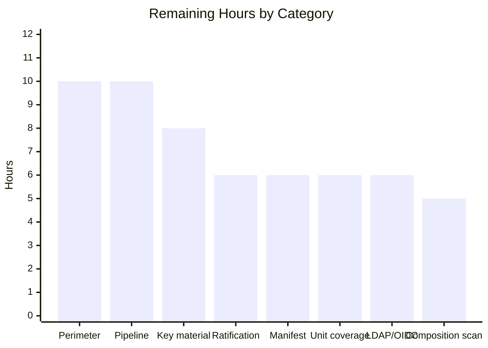

# 1. Executive Summary

## 1.1 Project Overview

`backend/execution-control` adds an Institutional Execution & Post-Trade Control Hub to the IBM Stock Trader estate as a self-contained Open Liberty microservice. It simulates institutional equity handling in two flows: a trader submits an order that is judged against four configurable pre-trade controls and is either rejected with an auditable reason or filled at its own limit price, and an operations analyst works a simulated settlement-instruction mismatch through assignment, resolution and settlement-ready marking. Every state change appends an immutable audit event. The service holds synthetic data in memory, exposes fourteen JSON operations, and reuses the estate's existing roles and JWT trust without adding a role, issuer or dependency.

## 1.2 Completion Status


Completed Work = Dark Blue `#5B39F3`; Remaining Work = White `#FFFFFF`.

| Metric | Value |
| --- | --- |
| **Total Hours** | 404 |
| **Completed Hours (AI + Manual)** | 347 (347 AI + 0 manual) |
| **Remaining Hours** | 57 |
| **Percent Complete** | **86%** |

Scoped work only: `(347 ÷ 404) × 100 = 85.9%`, reported as 86%. All eighteen scoped capabilities are delivered; the remaining 57 hours are path to production.

## 1.3 Key Accomplishments

- ✅ Four configurable pre-trade controls, all recorded on every order, equality passing and a cent over rejecting
- ✅ Order lifecycle to a simulated fill at the limit price, with the position updated atomically
- ✅ SSI-mismatch exceptions opened with enriched trade data and worked to settlement-ready
- ✅ Append-only audit timeline, gap-free at 20,685 events, with no update or delete path
- ✅ Fourteen JSON operations behind a role split that fails closed without a role
- ✅ 140 automated tests passing, at 97.5% and 95.8% coverage on the gated packages
- ✅ Container as UID 1001, a standalone manifest and a 2,311-line operator README
- ✅ Zero change elsewhere — 88 new files, sixteen submodules byte-identical

## 1.4 Critical Unresolved Issues

Twenty-one items are open. None is an unimplemented capability — all eighteen scoped capabilities are delivered and verified — and none is a code defect. Twelve of the sixteen recorded plan divergences await an owner's decision; nine operational items need a deployment decision.

| Issue | Impact | Owner | ETA |
| --- | --- | --- | --- |
| Twelve divergence-register rows carry no owner decision (rows 5–16 of the register in `backend/execution-control/README.md`) — 12 items | The delivered tree and the plan of record disagree on the runtime version, the file and status inventories and the identity configuration until each row is signed. No behavioural effect | Architecture owner | 6h |
| Liberty's own runtime web applications answer anonymous callers with Java type names, and `/openapi/ui` follows a forged `Host` into a redirect — 2 items | Information disclosure to anyone who can route to the pod. No data of this service is reachable and no token can be minted | Platform | 10h (with the perimeter work) |
| Inherited demonstration security material ships with the module — shared signing key, six expired trust anchors of eight, plaintext development users, keystore password in configuration — 1 item | Sample material, not usable credentials, but it must be replaced before any real deployment | Security | 8h |
| A cleartext HTTP listener runs alongside TLS in the default posture — 1 item | Credentials and payloads travel in the clear unless TLS is terminated upstream | Platform | Within the perimeter work |
| No software composition analysis has been executed against the dependency set — 1 item | Advisories beyond the targeted upgrades already applied are unverified | Build/Platform | 5h |
| `AUTH_TYPE` is trusted deployment input — a path-traversal value selects a different include — 1 item | A mistyped or externally supplied value can downgrade a JWT-verifying deployment to the bundled development registry. It grants nothing the supported value `none` grants | Platform | Documented rule |
| Accepted by design and documented: state lost on restart with `503` at the capacity ceilings; liveness independent of application install; roles fail closed without a `groups` claim — 3 items | Each is deliberate and recorded in the README. None blocks release, but each changes how the service is operated | Operations | Documented |

## 1.5 Access Issues

| System/Resource | Type of Access | Issue Description | Resolution Status | Owner |
| --- | --- | --- | --- | --- |
| NVD / OWASP Dependency-Check | Outbound network + API key | The vulnerability database cannot be built: the egress proxy blocks the scanner's release assets and no `NVD_API_KEY` is available. The opt-in `-Pdependency-check` profile is committed and ready to run | Open — needs a key or an allow-list | Build/Platform |
| Kubernetes cluster | Cluster credentials + `kubectl` | Neither is present, so the README's inline manifest was validated by parsing, field inspection and a configuration policy scan rather than applied to an API server | Open | Platform |
| LDAP directory / OIDC provider | Service endpoint + `OIDC_JWKS_URL` | No directory and no identity provider exist and the variable has no value, so the `ldap` and `oidc` authentication modes were never started | Open | Identity |
| Container registry / signing identity | Registry credentials + signing key | No registry credentials and no signing identity, so the documented image push, provenance and signature-verification commands were not executed | Open | Platform |

## 1.6 Recommended Next Steps

1. **[High]** Enforce the deployment perimeter before publishing the pod — publish only `/execution-control` and the three probe paths, apply the `NetworkPolicy`, terminate TLS, close the cleartext listener.
2. **[High]** Replace the inherited demonstration key material with deployment-owned keystores and secret-store passwords.
3. **[High]** Record an owner decision against each of the twelve undecided register rows; revert none.
4. **[High]** Provision `NVD_API_KEY`, run the committed composition scan and triage it.
5. **[Medium]** Apply the standalone manifest to a cluster and put the module behind a pipeline.

# 2. Project Hours Breakdown

## 2.1 Completed Work Detail

| Component | Hours | Description |
| --- | --- | --- |
| Order submission lifecycle | 30 | `lifecycle/OrderLifecycleService` — validation and symbol canonicalization, `clientOrderId` reservation, atomic evaluate-and-fill, `SUBMITTED → REJECTED` or `SUBMITTED → ACCEPTED → EXECUTED`, post-trade hand-off, all synchronous inside the submit request |
| Post-trade & settlement-exception workflow | 28 | `lifecycle/PostTradeService` and `LifecycleTransitions` — field-by-field settlement-instruction comparison, exception opening with denormalised trade data, assign/resolve/settlement-ready, SLA projection and status-dependent ageing, three transition tables |
| In-memory stores & synthetic seed data | 24 | `dao/` — `ConcurrentHashMap` stores with atomic per-key primitives and striped locks, plus the seed loader writing three clients, five positions and three orders through the live submit path |
| Pre-trade control engine | 22 | `control/` — four controls in a fixed order on every order, threshold semantics, exact reason text, and the MicroProfile Config producer behind them |
| Domain model | 20 | Twenty immutable `json/` types with monetary cent guards, derived notionals and simulation labels set in their constructors |
| REST API surface & error mapping | 20 | Fourteen operations across four resources, with typed failures mapped to `400`, `404` and `409` carrying a uniform error envelope |
| Role security, identity & Liberty configuration | 20 | `web.xml` per-method constraints with uncovered methods denied, the MP-JWT application class, `server.xml`, the `AUTH_TYPE` include mechanism and the shared trust material |
| Operator documentation | 20 | `README.md` (2,311 lines) — endpoint table, configuration tables, build and container commands, inline Kubernetes manifest, operational notes and the divergence register |
| Build wiring, container image & boundary discipline | 20 | `pom.xml` with Surefire, Failsafe, the Liberty plugin and JaCoCo all bound and actually executing; the Liberty image on the estate base; and the verified zero-diff estate boundary |
| Health probes, telemetry & OpenAPI | 14 | Liveness, readiness and startup probes on the platform's contract paths; `@WithSpan` instrumentation; the generated contract at `/openapi` |
| Append-only audit timeline | 10 | `audit/AuditTimeline` — synchronized append with monotonic sequence and UTC timestamp, unmodifiable snapshot reads, and no update or delete path |
| Capacity admission, request framing & error-surface hardening | 30 | Four capacity variables with start-up coherence checks and a `503` naming the variable to raise; clamped paging with total-count and `Link` headers; strict JSON binding; a request-size ceiling; a JSON body for container-decided refusals |
| Identity, transport & supply-chain hardening | 24 | Token minting closed and single sign-on disabled; a six-header response policy per listener with HSTS on TLS; product signature suppressed; encoded keystore password; bounded heap; owner-only key material in the image; patched runtime and dependency versions |
| Automated test suite & coverage gate | 65 | Four unit classes (89 tests) and four integration classes (51 tests) against a real Liberty server the build starts and stops, under an enforced line-coverage gate |
| **Total** | **347** | |

## 2.2 Remaining Work Detail

| Category | Hours | Priority |
| --- | --- | --- |
| Deployment perimeter enforcement — ingress path allow-list, `NetworkPolicy`, TLS termination, cleartext listener closed | 10 | High |
| CI/CD pipeline for the module — WAR build, image build and push with provenance and an SBOM, digest signing, deploy | 10 | Medium |
| Production key material & secret handling — deployment-owned keystores, secret-store-sourced keystore and LTPA passwords, no development registry | 8 | High |
| Plan-divergence ratification — an owner decision recorded against each of the twelve undecided register rows | 6 | High |
| Kubernetes manifest applied to a cluster and smoke-tested | 6 | Medium |
| Unit-level coverage for the REST provider chain and the health probes | 6 | Low |
| LDAP and OIDC identity-mode verification against a live directory and provider | 6 | Low |
| Software composition analysis — provision the key or allow-list, run the committed profile, triage | 5 | High |
| **Total** | **57** | |

## 2.3 Human Task List

| # | Priority | Task | Hours |
| --- | --- | --- | --- |
| H1 | High | Enforce the deployment perimeter: publish only `/execution-control` and the three probe paths with `pathType: Exact`, apply the in-cluster `NetworkPolicy`, terminate TLS at the ingress, and set the cleartext `httpPort` to `-1` or block it. This is what makes the runtime's own `/jwt`, `/health` sub-path and `/openapi/ui` surfaces unreachable | 10 |
| H2 | High | Replace the inherited demonstration security material: generate deployment-owned `key.p12` and `trust.p12` (the inherited trust store holds six expired anchors of eight entries), source the keystore and LTPA passwords from a secret store, and keep `AUTH_TYPE=none` to development and test only | 8 |
| H3 | High | Record an owner and a date against each of the twelve undecided rows of the divergence register in `backend/execution-control/README.md`. Rows 1–4 already carry a keep-as-delivered decision and still need the plan amendment signed. Do not revert — several rows carry security fixes | 6 |
| H4 | High | Provision `NVD_API_KEY` or allow-list the scanner download host, run `mvn -B -Pdependency-check dependency-check:check` in `backend/execution-control`, and triage the report | 5 |
| M1 | Medium | Build the module's CI/CD pipeline — WAR, image build and push with provenance and an SBOM, digest signing and verification, deploy. No workflow ships with the module because the estate's build workflows end by patching a GitOps custom-resource entry that is outside this change's boundary | 10 |
| M2 | Medium | Apply the README's inline manifest to a cluster and smoke-test it: the three probes on 9080, the `ClusterIP` service, `readOnlyRootFilesystem`, the `emptyDir` size limits, then the documented review commands through a port-forward | 6 |
| L1 | Low | Add unit-level coverage for the REST provider chain and the health probes — including the `503` capacity mapper's response path, the liveness probe's empty-store and store-failure branches, and the count read paths behind the total-count header | 6 |
| L2 | Low | Verify `AUTH_TYPE=ldap` and `AUTH_TYPE=oidc` against a live directory and identity provider, confirming the provider emits a `groups` claim containing `StockTrader` or `StockViewer` — without it every protected request answers `403` by design | 6 |
| | | **Total** | **57** |

# 3. Test Results

The suite runs under `mvn -B clean verify` from `backend/execution-control`: Surefire executes the four unit classes, the Liberty plugin creates, starts and stops a real server around the four integration classes, and JaCoCo enforces a line-coverage gate. The last full run completed in 24.9 s with **140 of 140 tests passing** — 89 unit and 51 integration, zero failures, zero errors, zero skipped — and reported "All coverage checks have been met."

| Area / Category | Framework | Tests | Passed | Failed | Coverage | What This Proves |
| --- | --- | --- | --- | --- | --- | --- |
| Order lifecycle & submission | JUnit 5 (Surefire) | 35 | 35 | 0 | `lifecycle` 95.8% line | An order is validated, canonicalized, admitted once per `clientOrderId`, filled atomically and driven to its terminal state, or refused with the offending field named |
| Pre-trade controls | JUnit 5 (Surefire) | 23 | 23 | 0 | `control` 97.5% line | All four controls are recorded on every order, a value exactly at a threshold passes and one cent over rejects, in both directions of the share range |
| Post-trade & settlement exceptions | JUnit 5 (Surefire) | 21 | 21 | 0 | `lifecycle` 95.8% line | A mismatching settlement instruction opens an exception naming the differing field, and assign → resolve → settlement-ready is the only legal route through it |
| Audit timeline | JUnit 5 (Surefire) | 10 | 10 | 0 | `audit` 80.6% line | Events are append-only, monotonically sequenced and timestamped, and the read views cannot be mutated |
| Order submission over HTTP | Failsafe + Liberty | 22 | 22 | 0 | Runtime | The wire contract holds end to end: `201` with the terminal state, `400` naming the field, `409` on a repeat key, and a malformed or oversize body refused without internals |
| Settlement-exception workflow over HTTP | Failsafe + Liberty | 15 | 15 | 0 | Runtime | The seeded mismatch is worked through all three transitions with `200` each, and an illegal transition answers `409` with no event written |
| Role security over HTTP | Failsafe + Liberty | 9 | 9 | 0 | Runtime | Anonymous callers get `401`, a viewer `403` on every mutating verb and `200` on reads, a trader `201`, and uncovered methods are denied |
| Health probes over HTTP | Failsafe + Liberty | 5 | 5 | 0 | Runtime | All three probe paths answer `200` with an `UP` status on the port the platform probes |

Coverage is measured in the unit-test JVM only, by design: the integration JVM is deliberately uninstrumented, so the gated figures above cover the business packages rather than the module as a whole. Module-wide line coverage from the same report is 63.6%, with `json` at 83.9%, `dao` at 82.0% and `audit` at 80.6%.

**Not Covered**

- **The REST provider chain (`rest/`, 17 classes) and the health probes (`health/`, 4 classes) carry no unit-level coverage** — both report 0% in the coverage report because they are exercised only by the 51 integration tests, which run in the uninstrumented server JVM. Their behaviour is proven at runtime; their branches are not measured. Add unit tests here before treating the coverage figure as a quality signal for these packages.
- **The `503` capacity refusal path** is not driven by any automated test. The failure type behind it is unit-tested and the refusal was exercised directly at a lowered ceiling, but no committed test invokes the mapper.
- **Liveness probe branches** — the empty-store path and the store-failure path — have no committed test, because no endpoint can empty a seeded store.
- **Read-count paths** behind the total-count header (`count`, `eventCount`) carry no unit test; they produce every paging header observed at runtime.
- **Defensive guards that no request can reach**: the duplicate-identifier and ceiling refusals inside the exception and position stores, the null-price guard in the position model, the `PATCH` arm of the entity-read filter (the method is denied before any filter runs), the `+json` subtype and compressed-entity branches of the JSON gate, and the container error page for a `500`. Each was judged by reading the code rather than by execution.
- **The TLS listener (9443)** has no automated coverage — the integration tests address the cleartext port the build publishes. Its header and compression policy were confirmed directly and by configuration parity with the cleartext listener.
- **The `ldap` and `oidc` authentication modes** were never started: no directory and no identity provider is reachable here. Test both before using either in a deployment.
- **The inline Kubernetes manifest** has never been applied to a cluster. It was parsed, inspected field by field and policy-scanned, and its read-only-root posture was proven with the container equivalent, but kubelet-enforced behaviour and volume eviction are reasoned rather than observed.

# 4. Runtime Validation &amp; UI Verification

The service was driven as a running process — under the Liberty server the build starts, and as a container image on both authentication modes. There is no user interface to verify: the review surface is the JSON API, and `frontend/trader` is untouched, so no screen, component or browser flow exists in this project.

- ✅ **Start-up and health** — Operational. The container is ready in 4–6 s; `/health/started`, `/health/ready` and `/health/live` each answer `200` with an `UP` status on port 9080, unauthenticated, and readiness reports the resolved JWT audience and issuer plus every capacity and headroom pair.
- ✅ **Order submission and control evaluation** — Operational. `POST /orders` with `INST-001 BUY SYNA 100 @ 100.00` returns `201` as `ORD-000004`, `EXECUTED`, filled at `100.00` at venue `SIMULATED`, labelled `simulated` with `source API` and carrying all four control results; a restricted symbol returns `REJECTED` with `Symbol RSTRA is on the restricted list RESTRICTED_SYMBOLS`.
- ✅ **Refusal semantics** — Operational. A repeat `clientOrderId` answers `409`, a negative quantity `400`, an unknown order id `404`; an oversize body answers `413` on both framings, a compressed body `415`, and a saturated ceiling `503` naming the variable to raise.
- ✅ **Post-trade exception workflow** — Operational. The seeded mismatch `EXC-000001` reports `SSI_MISMATCH` for `INST-003 Fabrikam Capital Partners` on `safekeepingAccount` (`SAFE-FB-0003` against `SAFE-FB-9903`) with an SLA deadline 24 h after opening, and assign → resolve → settlement-ready each answer `200`, carrying the parent order to `SETTLEMENT_READY`.
- ✅ **Audit timeline** — Operational. An executed clean order produces exactly five events across the order and post-trade machines, each timestamped with a strictly increasing sequence and the calling principal as actor; the sequence was gap-free at 20,685 events after 4,000 concurrent submissions; write verbs on `/audit` are refused with the record unchanged.
- ✅ **Reference and seed data** — Operational. `/controls` reports the five effective limits with `source CONFIG`, `/clients` three synthetic clients each with both settlement instructions, `/positions` five holdings; seed state is identical on every fresh start and after a restart.
- ✅ **Role security and identity** — Operational. Anonymous callers receive `401`, a viewer `403` on every mutating verb and `200` on reads, a trader `201`, an authenticated identity carrying no role `403` on everything; uncovered methods are denied. Under JWT mode, tokens minted with the estate's own signing key are accepted, a token without a `groups` claim is refused `403`, and expired, wrong-issuer, wrong-audience, tampered and unsigned tokens are all refused `401`.
- ✅ **Container and deployment posture** — Operational. The image runs as UID 1001 with a bounded heap (227 MiB resident), key material readable only by its owner, and the documented read-only-root posture works with writes to the runtime refused.
- ⚠ **Runtime endpoints beside the application** — Partial. `/openapi` and `/openapi/ui` serve the generated contract, but two paths published by the runtime rather than by this service answer anonymous callers with Java type names, and `/openapi/ui` follows a forged `Host` into a redirect. Both are closed by the deployment perimeter, not by module code.
- ❌ **Not exercised at runtime** — the `ldap` and `oidc` authentication modes (no directory or identity provider is reachable), the Kubernetes manifest against a live API server (no cluster), and the image push, provenance and signature-verification flow (no registry or signing identity).

# 5. Compliance &amp; Quality Review

## 5.1 Compliance Matrix

| # | Scoped Deliverable | Benchmark | Status | Evidence |
| --- | --- | --- | --- | --- |
| 1 | Order lifecycle and simulated execution | `SUBMITTED → REJECTED` or `SUBMITTED → ACCEPTED → EXECUTED` inside the submit request, with a fill at the order's own limit price at venue `SIMULATED` and no exchange or routing path | ✅ Pass | `lifecycle/OrderLifecycleService`, `json/Execution`; 35 unit and 22 integration tests; terminal state returned in the `201` body |
| 2 | Configurable pre-trade controls | Four controls, one environment variable each, all evaluated on every order with every result recorded; equality passes, strictly greater rejects | ✅ Pass | `control/PreTradeControlService`; 23 unit tests; `control` package at 97.5% line coverage |
| 3 | Post-trade lifecycle and exception surface | `PENDING_AFFIRMATION` then `EXCEPTION` or `SETTLEMENT_READY`, and `EXCEPTION → SETTLEMENT_READY` on resolution; assign requires an owner, resolve a note, settlement-ready only from resolved | ✅ Pass | `lifecycle/PostTradeService`, `LifecycleTransitions`, `rest/SettlementExceptionResource`; 21 unit and 15 integration tests; missing fields `400`, illegal transitions `409` |
| 4 | Simulated SSI-mismatch exception | One seeded client's counterparty instruction differs deterministically on the safekeeping account; every execution for it opens an exception with the enriched trade data and the differing field | ✅ Pass | `dao/SeedDataLoader`; `EXC-000001` observed with `safekeepingAccount SAFE-FB-0003` against `SAFE-FB-9903` |
| 5 | Auditable timeline | Append-only events with entity, states, actor, timestamp and reason; readable per order, per exception and in full; no update or delete path | ✅ Pass | `audit/AuditTimeline`; 10 unit tests; sequence gap-free at 20,685 events; write verbs refused |
| 6 | Exception ageing | Deadline fixed at opening against the configured SLA, with ageing computed on read and frozen once resolved | ✅ Pass | `EXC-000001` reporting a deadline 24 h after opening, and the SLA hours override observable in behaviour |
| 7 | Review surface | A JSON API only, with no dashboard page and no frontend change | ✅ Pass | Fourteen operations across thirteen paths at `/openapi`; `frontend/trader` at zero diff |
| 8 | Seeded synthetic data | Reference data written straight into the store with no transition and no event; three historical orders submitted through the live submit path | ✅ Pass | Thirteen seed events, all attributable to the three orders and one exception, none to clients or positions |
| 9 | Role model and identity reuse | `StockTrader` and `StockViewer` only, per-method constraints, uncovered methods denied, existing JWT issuer, audience and trust material | ✅ Pass | `web.xml`; 9 role tests; trust material byte-identical to the estate's (`trust.p12` md5 `f9877a2a…`) |
| 10 | Platform contracts | Health probes on the chart's paths and port; environment-variable configuration with safe defaults; in-memory storage only | ✅ Pass | `health/`; `microprofile-config.properties`; observed defaults match the README table exactly |
| 11 | Test wiring and coverage | Unit and integration plugins both bound and actually executing against a real server, with a ≥80% line gate on the new business logic | ✅ Pass | 140 tests executed; `control` 97.5%, `lifecycle` 95.8%; gate enforced at `verify` |
| 12 | Estate boundary and plan fidelity | No change outside the new module, and a delivered tree matching the plan's pins and inventories | ⚠ Partial | Boundary clean — 88 files added, nothing outside `backend/execution-control/`, all sixteen submodules byte-identical. Sixteen recorded divergences from the pins, twelve awaiting an owner decision — see 5.2 |

## 5.2 AAP &amp; Rule Divergences and Gaps

No user-specified rules exist for this project, so no user-rule divergence is possible. Every divergence below is from the frozen implementation plan, and all sixteen are inventoried in the module's own register at `backend/execution-control/README.md` § *Deviations from the frozen implementation plan*. Rows 1–4 carry a recorded keep-as-delivered decision; the remaining twelve carry no decision yet.

| What the AAP/Rule Required | What Was Delivered Instead | Why It Diverged | Impact | Remediation |
| --- | --- | --- | --- | --- |
| Open Liberty 25.0.0.9 as both base image and integration-test assembly under the `wlp-webProfile10` coordinate, with a REST client at 4.1.1, a JSON parser at 1.1.7 and four build plugins pinned | Liberty 26.0.0.9 in both, the image digest-pinned and the assembly under the `openliberty-runtime` coordinate; the client at 4.1.8, the parser at 1.1.9 and the four plugins lifted with four pinned transitive dependencies | Each pinned version is named by a published advisory, and the planned assembly coordinate has no patched publication at all | None functional; a cold build downloads a larger assembly | Ratify register rows 1, 2, 3 and 12, or name a release carrying the same fix |
| An exhaustive 71-file inventory, three typed lifecycle failures, three error mappers, and a status matrix with no `503` and no paging | 88 tracked files, including a capacity failure and its mapper, a paging helper, four capacity classes, six further providers, a container error servlet and a heap-options file; plus optional clamped paging and a `503` | A service holding all state in memory with no eviction has no bound on growth, and the planned error surface leaves an unreadable body or a container-decided refusal answering `500` or carrying no body at all | Additive only — no planned status changed, and a caller sending no paging parameter sees the body it saw before | Ratify register rows 5–10; replace only with an eviction policy or a datastore, never by removing the ceilings |
| A single HTTP endpoint mirroring the sibling broker, with no response-header policy specified | Two scheme-specific endpoints, each with its own header policy, the product signature suppressed, a request-size ceiling and bounded heap options | The mirrored endpoint advertises the product signature and asserts no content-type, cache or transport-security policy, and a header policy is scoped to an endpoint rather than to a scheme | None to ports, context root, probe paths or success codes; an oversize body now answers `413` | Ratify register row 4 |
| The four authentication include files as verbatim copies, and the server configuration carrying the listed elements and nothing else | One element deleted from three of the four includes, a token builder pinned to an absent key alias, and three further server elements | As copied, any authenticated registry identity can mint tokens signed with the estate's shared key, and a single-sign-on cookie outranks the `Authorization` header, so the recorded actor follows the cookie | None on accepting estate tokens; no cookie is issued at all | Ratify register rows 15 and 16 |
| The literal keystore password in configuration, two telemetry keys, the packaging plugin with a single flag, and seven build plugins | The same password in encoded form, a third telemetry key restricting propagators, the archive descriptor suppressed, and a scanning plugin inside an opt-in profile | The literal password would ship in the tree, the runtime's bundled propagator is named by an advisory, the archive descriptor ships a version-precise dependency inventory inside the deployed archive, and the estate has no composition scanning | None functional; no default build activates the profile | Ratify register rows 11, 13 and 14; provision the scanner's key |
| Submit-time validation enumerated as required fields, a positive quantity, a positive price and a known client; canonicalization by trim and upper-case | The same, plus refusals for a sub-cent price, a price above a fixed per-share ceiling, a fractional quantity and an unrepresentable share count; canonicalization by Unicode-aware strip | The enumerated set admits a price below one cent, which the monetary model then holds as zero, so all three amount controls would observe zero and pass; and an unbounded share sum cannot be represented | No planned case changes its answer; every documented default, seeded price and test price is unaffected | None required; fold into the register if the inventories are republished |
| The plan's own evidence recipe for the server lifecycle, its cap on test volume, and a class summary placed between annotations and declaration | The lifecycle evidenced by the goal banners the build actually prints plus the server's ready and stopped messages; 140 tests; summaries placed above the annotations | The recipe's literal pattern never matches, because the build prints the plugin's short prefix; and a comment between an annotation and the declaration is not a documentation comment | None on delivered behaviour | None required; match the printed prefix if the recipe is reused |

**Runtime and dependency versions.** The plan fixed the runtime at a release inside a published advisory range for request smuggling and resource exhaustion, whose stated remedy is a later fix pack; the planned test-assembly coordinate publishes nothing patched, so the assembly moved with the image. The same reasoning carried the test REST client and JSON parser forward and lifted four build plugins with four pinned transitive dependencies. Every version remains explicit, so the plan's rule against floating versions holds, and the evidence sits in `backend/execution-control/pom.xml` and `Dockerfile`. The decision a human owns is whether to ratify the amendment or name a different release carrying the same fix; reverting restores a known-vulnerable runtime and is not offered.

**File and status inventory.** The plan enumerated 71 files exhaustively; the tree holds 88. Seventeen are additions: ten REST providers and a paging helper, a capacity failure type, three capacity classes, a capacity report, a raw-framing test client and a heap-options file. They exist because an in-memory service that evicts nothing needs a bound — `ORDER_CAPACITY`, `SETTLEMENT_EXCEPTION_CAPACITY`, `POSITION_CAPACITY` and `AUDIT_EVENT_CAPACITY`, each refusing with `503` rather than taking a state change unrecorded — and because collection reads need a page ceiling with a total count and `Link` traversal to keep the audit record reachable. Ratify register rows 5–10, or replace the ceilings with an eviction policy or a datastore.

**HTTP perimeter and response policy.** The mirrored single endpoint advertises the product signature and asserts no content-type, cache or transport-security policy, and Liberty scopes a header policy to an endpoint rather than to a scheme, so transport security cannot be asserted to TLS clients alone from one endpoint. `src/main/liberty/config/server.xml` now declares one endpoint per scheme, each with six response headers, the product signature suppressed and a request-size ceiling, and `jvm.options` bounds the heap. Ports, context root, probe paths and every success code are the plan's. One consequence is visible to callers: a body beyond the ceiling answers `413`, a status the plan's matrix does not name. Ratify register row 4.

**Identity configuration.** The plan required the four include files byte-identical, because the estate's cross-service JWT trust rests on shared material. As copied they also let the service *issue*: any authenticated registry identity can mint an estate-signed token at the runtime's token endpoint, and a single-sign-on cookie outranks the `Authorization` header, so the audited actor follows the cookie rather than the presented credential. One element is now deleted from three of the four includes — the fourth is still byte-identical — a builder is pinned to an absent alias, and single sign-on is off. The consuming side and the trust store are untouched (`trust.p12` md5 `f9877a2a…`), so estate-issued tokens are still accepted. Ratify register rows 15 and 16.

**Configuration, packaging and scanning.** The keystore password ships in the runtime's encoded form rather than as a literal, in the same three places. A third telemetry key restricts propagators, so the runtime's bundled implementation of an advisory-named propagator is never installed while tracing and span recording continue unchanged. The packaging plugin no longer writes a version-precise dependency inventory into the deployed archive. And a composition-analysis plugin sits in an opt-in profile that no default build activates. Ratify register rows 11, 13 and 14; row 14 additionally needs the scanner's API key or a network allow-list before it can produce a report at all.

**Submit-time validation.** The plan enumerated validation as required fields, a positive quantity, a positive price and a known client. A price of `0.001` satisfies all four, and the monetary model holds money at two decimals, so the notional derived from it is zero and all three amount controls would observe zero and pass — a risk control under-reporting rather than over-reporting. `lifecycle/OrderLifecycleService` therefore also refuses a price that cannot be held in whole cents, a price above a fixed per-share ceiling, a fractional quantity and a share count that cannot be represented, each `400` naming the field; canonicalization uses a Unicode-aware strip, identical for every ASCII input. No planned case changes its answer.

**Plan evidence and authoring notes.** Three small departures carry no behavioural weight. The plan's command for proving the server lifecycle matches a string the build never prints, so the lifecycle is evidenced instead by the goal banners it does print plus the server's ready and stopped messages. The plan capped test volume at its enumerated cases; the suite holds 140 tests, each addition pinning one specific behaviour the enumerated set leaves unasserted rather than adding a parameterized sweep. And the one-line class summaries sit above each class's annotations rather than between the annotations and the declaration, because a comment in the latter position produces no generated documentation. None of the three needs action.

# 6. Risk Assessment

| Risk | Category | Severity | Probability | Mitigation | Status |
| --- | --- | --- | --- | --- | --- |
| The module ships the estate's inherited demonstration security material — the shared signing key, six expired trust anchors of eight, plaintext development users and a keystore password in configuration | Security | High | High if deployed unchanged | Replace with deployment-owned keystores and secret-store-sourced passwords before any real deployment, and keep the development authentication mode to development and test only | Open — remaining task H2 |
| Two paths published by the runtime rather than by this service answer anonymous callers with Java type names, and the contract's interactive page follows a forged `Host` into a redirect | Security | Medium | High without a perimeter | Publish only `/execution-control` and the three probe paths with `pathType: Exact` and apply the in-cluster `NetworkPolicy`; the log warning and stack are already suppressed and incident files deduplicated and age-bounded | Open — remaining task H1 |
| A cleartext HTTP listener runs alongside TLS in the default posture | Security | Medium | Medium | Terminate TLS at the ingress or set the cleartext port to `-1` in production | Open — remaining task H1 |
| `AUTH_TYPE` is trusted deployment input: a path-traversal value selects a different authentication include | Security | Medium | Low | Set it from the deployment only, never from anything a caller can influence; validation belongs in an admission policy, not in a forked include whose byte-identity the estate's trust depends on | Accepted with a documented rule |
| All state is held in memory and lost on restart, and the four capacity ceilings answer `503` at their limits rather than take a state change unrecorded | Operational | Medium | High — a restart is certain | Appropriate for synthetic simulation; size the ceilings and the pod memory limit together, and introduce a datastore if durability is ever required | Accepted by design |
| No software composition analysis has been executed against the dependency set | Technical | Medium | Medium | Run the committed opt-in scan once its key or network path exists; the published-advisory checks and container image scan documented in the README are the interim substitutes | Open — remaining task H4 |
| The sibling Liberty services in the estate still run the older base image that sits inside the same advisory range this module moved off | Integration | Medium | Medium | Raise an estate-wide base-image upgrade and digest-pin those build files under their own change control; they are outside this module's change boundary and were not touched | Open — referred |
| The module has no pipeline, chart participation or deployment automation, and twelve recorded plan divergences carry no owner decision | Operational | Medium | Medium | Remaining tasks M1 and H3: build the pipeline, and record a decision against each undecided register row | Open |

# 7. Visual Project Status


Colours: **Completed Work = Dark Blue `#5B39F3`**, **Remaining Work = White `#FFFFFF`**. Total 404 hours, 86% complete.


Remaining hours by category, as itemised in Section 2.2:



| Dimension | Completed | Remaining |
| --- | --- | --- |
| Hours | 347 | 57 |
| Share of total | 86% | 14% |
| Scoped capabilities delivered | 18 of 18 | 0 |
| Automated tests passing | 140 of 140 | — |

# 8. Summary &amp; Recommendations

The Institutional Execution & Post-Trade Control Hub is delivered and working. `backend/execution-control` is a new Open Liberty microservice of 88 files and 19,038 lines across nineteen commits, and every one of the eighteen capabilities the plan scoped is implemented and verified at runtime: order submission with four configurable pre-trade controls whose thresholds pass on equality and reject one cent over; a simulated fill at the order's own limit price with the client position updated atomically; post-trade affirmation that opens a settlement-instruction mismatch carrying the enriched trade data and the differing field, and works it through assignment, resolution and settlement-ready marking; and an append-only audit timeline that proved gap-free at 20,685 events. Fourteen JSON operations sit behind a per-method role split that fails closed for an authenticated identity carrying no role. Nothing else in the estate changed — all sixteen sibling submodules are byte-identical to their pinned commits.

The evidence is a test suite that genuinely runs. `mvn -B clean verify` executes 89 unit tests and, against a Liberty server the build itself starts and stops, 51 integration tests — 140 of 140 passing, with the enforced line-coverage gate met at 97.5% on the control package and 95.8% on the lifecycle package against a 0.80 minimum. Beyond the suite, the service was exercised as a container on both authentication modes: the full identity-and-verb matrix, the complete accept-and-reject matrix for tokens minted with the estate's own signing key, concurrency (eight simultaneous submissions of one idempotency key yielding exactly one order and seven conflicts, and 4,000 sustained orders with exact arithmetic), start-up configuration validation that refuses an unusable limit rather than serving silently, and the documented read-only-root container posture.

What remains is not feature work. The 57 outstanding hours are the path to production: a deployment perimeter, production credentials, a cluster deployment, a pipeline and a governance signature. Four items sit on the critical path and are best done in order. First the perimeter — publish only `/execution-control` and the three probe paths, apply the in-cluster network policy, terminate TLS and close the cleartext listener; this is what makes the runtime-published paths that disclose Java type names, and the contract page that follows a forged `Host`, unreachable. Second, replace the inherited demonstration key material: it carries the estate's shared signing key and six expired trust anchors of eight, and the plan required it copied byte-identically, so it can only be replaced at deployment. Third, run the composition scan once its API key or network path exists. Fourth, record an owner decision against each of the twelve undecided divergence-register rows.

Twenty-one items are open, and their character matters as much as their number: not one is an unimplemented capability or a code defect. Twelve are register rows awaiting a signature, six are deployment decisions the service cannot make for itself, and three are behaviours accepted by design and documented — state lost on restart with `503` at the capacity ceilings, liveness deliberately independent of application install, and roles that fail closed without a `groups` claim. The divergences themselves deserve reading rather than skimming: the delivered runtime, two test dependencies, four build plugins, the HTTP perimeter and the identity configuration all sit outside the frozen plan's pins, each to close a specific exposure, and the file and status inventories exceed the plan by seventeen files, a `503` and two optional paging parameters in order to bound a service that holds all of its state in memory.

**Production readiness: ready behind a perimeter, not ready as it stands.** The application layer is sound — the API, both lifecycles, the audit guarantee, the role model, the configuration contract and the test wiring all meet their benchmarks, and the code carries no placeholder, stub or unimplemented path. What is not yet safe is the default deployment posture: demonstration credentials, a cleartext listener, runtime paths that should never be published, and no pipeline to deploy the service reproducibly. The success metrics for that work are concrete: every probe path answered through the ingress and nothing else reachable; the module's own keystores in place with passwords drawn from a secret store; a composition-scan report with no unaccepted finding; the manifest applied and smoke-tested on a cluster; and sixteen register rows each carrying an owner and a date.

# 9. Development Guide

Every command below was executed against this tree and printed what it claims. Run them from the repository root unless a directory is named.

## 9.1 System Prerequisites

| Requirement | Version used | Notes |
| --- | --- | --- |
| JDK | Temurin OpenJDK **17.0.20.1+1** | The module compiles at release 17. A JDK 21 is needed only for the sibling modules that compile at 21 (`frontend/trader`, `backend/trade-history`, `backend/account`, `backend/portfolio-assistant`) |
| Apache Maven | **3.9.11** | The highest version the estate documents |
| Docker Engine | **29.7.2** | Needed only for the container flow and for sibling modules that use test containers |
| Memory | ~1 GB free per build | One full gate (Maven JVM plus the Liberty server) costs roughly 600–800 MB |
| Network | Maven Central, or a warm local repository | A warm repository runs the whole gate offline with `-o` |

```bash
# Confirm the toolchain
java -version          # openjdk version "17.0.20.1"
mvn -v                 # Apache Maven 3.9.11
docker --version       # Docker version 29.7.2
```

## 9.2 Environment Setup

No configuration is required — the service starts with nothing supplied, and every business rule has a safe default. Set variables only to override them.

```bash
# Select a JDK explicitly when a sibling module needs 21; the module itself uses the default 17
export JAVA_HOME=/opt/java/jdk17     # this module
# JAVA_HOME=/opt/java/jdk21 mvn ...  # a JDK 21 sibling, on the same command line

cd backend/execution-control
```

- **Business rules** — `MAX_ORDER_NOTIONAL`, `MAX_POSITION_NOTIONAL`, `FAT_FINGER_NOTIONAL_THRESHOLD`, `RESTRICTED_SYMBOLS`, `EXCEPTION_SLA_HOURS`.
- **Capacity ceilings** — `ORDER_CAPACITY`, `SETTLEMENT_EXCEPTION_CAPACITY`, `POSITION_CAPACITY`, `AUDIT_EVENT_CAPACITY`.
- **Server and identity** — `AUTH_TYPE`, `JWT_AUDIENCE`, `JWT_ISSUER`, `DEFAULT_HTTP_PORT`, `DEFAULT_HTTPS_PORT`, `MAX_REQUEST_SIZE_BYTES`, `TRACE_SPEC`.
- **Telemetry** — `OTEL_SDK_DISABLED`, `OTEL_EXPORTER_OTLP_ENDPOINT`.

Every default and its meaning is in Appendix E and in the module README's Configuration section. An unusable value — a non-positive or sub-cent limit, a non-numeric value, or an audit ceiling below ten events per order — stops the application from installing and names the offending variable in the server log, with readiness and startup answering `503` while liveness stays `200`.

## 9.3 Dependency Installation and Build

Maven resolves everything on the first build; no separate install step exists.

```bash
cd backend/execution-control

# Unit tests only — fastest feedback, about 5 s warm
mvn -B test
# Expect: Tests run: 89, Failures: 0, Errors: 0, Skipped: 0 → BUILD SUCCESS

# Unit tests with the coverage report
mvn -B test jacoco:report
# Writes target/site/jacoco/index.html and target/site/jacoco/jacoco.xml

# Full gate: unit tests, a real Liberty server started around the integration tests, then the coverage gate
mvn -B clean verify
# Expect: 89 unit + 51 integration tests, 0 failures; "All coverage checks have been met."; BUILD SUCCESS (~25 s warm)

# Package the deployable archive without tests
mvn -B clean package -DskipTests
ls -l target/ExecutionControl.war      # about 140 KB
```

On a shared host, move the integration server off the default ports — both the server and the test client follow the same two properties:

```bash
mvn -B clean verify \
  -Dliberty.var.default.http.port=20500 \
  -Dliberty.var.default.https.port=20501
```

## 9.4 Running the Service

```bash
cd backend/execution-control
mvn -B clean package -DskipTests
docker build -t execution-control:local .

docker run -d --name ec \
  -p 127.0.0.1:9080:9080 \
  -e AUTH_TYPE=none \
  -e OTEL_SDK_DISABLED=true \
  execution-control:local
# Ready in 4–6 s. Bind to 127.0.0.1 so the development credentials never leave the host.
```

Development credentials come from the bundled registry that `AUTH_TYPE=none` selects: `stock:trader` holds `StockTrader` (may write), `read:only` holds `StockViewer` (may read). Leaving `AUTH_TYPE` at its default puts the service behind JWT verification, where application endpoints answer `401` without a valid estate token.

## 9.5 Verification Steps

```bash
# 1. Probes — each answers 200 with an UP status, unauthenticated
for h in started ready live; do
  echo -n "/health/$h -> "; curl -s -o /dev/null -w '%{http_code}\n' localhost:9080/health/$h
done

# 2. Submit an order that passes every control
curl -s -u stock:trader -X POST http://localhost:9080/execution-control/orders \
  -H 'Content-Type: application/json' \
  -d '{"clientOrderId":"DEV-1","clientId":"INST-001","symbol":"SYNA","side":"BUY","quantity":100,"limitPrice":100.00}'
# 201: status EXECUTED, postTradeStatus SETTLEMENT_READY, execution.fillPrice 100.00,
#      venue SIMULATED, simulated true, source API, four controlResults

# 3. Submit an order a control refuses
curl -s -u stock:trader -X POST http://localhost:9080/execution-control/orders \
  -H 'Content-Type: application/json' \
  -d '{"clientOrderId":"DEV-2","clientId":"INST-001","symbol":"RSTRA","side":"BUY","quantity":10,"limitPrice":10.00}'
# 201: status REJECTED, rejectionReason "Symbol RSTRA is on the restricted list RESTRICTED_SYMBOLS"

# 4. Refusal semantics
curl -s -o /dev/null -w 'repeat key: %{http_code}\n'  -u stock:trader -X POST http://localhost:9080/execution-control/orders \
  -H 'Content-Type: application/json' -d '{"clientOrderId":"DEV-1","clientId":"INST-001","symbol":"SYNA","side":"BUY","quantity":1,"limitPrice":100.00}'   # 409
curl -s -o /dev/null -w 'bad quantity: %{http_code}\n' -u stock:trader -X POST http://localhost:9080/execution-control/orders \
  -H 'Content-Type: application/json' -d '{"clientOrderId":"DEV-3","clientId":"INST-001","symbol":"SYNA","side":"BUY","quantity":-5,"limitPrice":100.00}'  # 400
curl -s -o /dev/null -w 'unknown id: %{http_code}\n'  -u stock:trader http://localhost:9080/execution-control/orders/ORD-999999                            # 404

# 5. Role split
curl -s -o /dev/null -w 'anonymous POST: %{http_code}\n' -X POST http://localhost:9080/execution-control/orders -H 'Content-Type: application/json' -d '{}'   # 401
curl -s -o /dev/null -w 'viewer POST:    %{http_code}\n' -u read:only -X POST http://localhost:9080/execution-control/orders -H 'Content-Type: application/json' -d '{}'  # 403
curl -s -o /dev/null -w 'viewer GET:     %{http_code}\n' -u read:only http://localhost:9080/execution-control/orders                                          # 200
```

## 9.6 Example Usage — Working a Settlement Exception

```bash
B=http://localhost:9080/execution-control

# The seeded mismatch, open from start-up
curl -s -u read:only "$B/exceptions?status=OPEN"
# EXC-000001, SSI_MISMATCH, INST-003 "Fabrikam Capital Partners", source SEED,
# mismatchFields[0] = {safekeepingAccount, SAFE-FB-0003, SAFE-FB-9903}, slaDeadline = openedAt + 24h

curl -s -u stock:trader -X PUT "$B/exceptions/EXC-000001/assign" \
  -H 'Content-Type: application/json' -d '{"owner":"ops.analyst"}'            # 200 ASSIGNED
curl -s -u stock:trader -X PUT "$B/exceptions/EXC-000001/resolve" \
  -H 'Content-Type: application/json' -d '{"resolutionNote":"Counterparty SSI corrected"}'   # 200 RESOLVED
curl -s -u stock:trader -X PUT "$B/exceptions/EXC-000001/settlement-ready" \
  -H 'Content-Type: application/json' -d '{}'                                 # 200 SETTLEMENT_READY

# The audit trail for an order — five events across the two state machines
curl -s -u read:only "$B/orders/ORD-000004/events"
#  14 ORDER      (none) -> SUBMITTED            | stock
#  15 ORDER      SUBMITTED -> ACCEPTED          | stock
#  16 ORDER      ACCEPTED -> EXECUTED           | stock
#  17 POST_TRADE (none) -> PENDING_AFFIRMATION  | stock
#  18 POST_TRADE PENDING_AFFIRMATION -> SETTLEMENT_READY | stock

# Effective rules and reference data
curl -s -u read:only "$B/controls"    # five limits with source CONFIG
curl -s -u read:only "$B/clients"     # three synthetic clients, both settlement instructions each
curl -s -u read:only "$B/positions"   # five holdings
curl -s http://localhost:9080/openapi # the generated contract: 14 operations across 13 paths

docker rm -f ec                       # tear down
```

## 9.7 Troubleshooting

| Symptom | Cause | Resolution |
| --- | --- | --- |
| Repeating telemetry export failures in the log naming a cluster-local collector | Tracing is enabled by default and points at the estate's in-cluster collector, which a local run cannot reach. The failures are non-fatal | Add `-e OTEL_SDK_DISABLED=true` to the container, or `-Dliberty.env.OTEL_SDK_DISABLED=true` to the Maven command |
| Application paths answer `404` while `/health/live` answers `200` and readiness answers `503` | A configuration value is unusable, so the server started but the application did not install | Read the server log for the one-line refusal naming the variable, correct it and restart. Liveness is deliberately independent of application install |
| Every authenticated request answers `403` | The token carries no `groups` claim, so neither role resolves. This is fail-closed by design | Configure the identity provider to emit `groups` containing `StockTrader` or `StockViewer` |
| Application endpoints answer `401` with correct credentials | `AUTH_TYPE` is at its default, which verifies JWTs rather than accepting basic credentials | Use an estate-issued token, or set `AUTH_TYPE=none` for development and test only |
| Integration tests fail to bind, or a sibling module's server clashes | The default ports are in use — several estate modules hard-code 9080 and 9443 | Pass `-Dliberty.var.default.http.port` and `-Dliberty.var.default.https.port`, or run those modules one at a time |
| Edits to the generated `target/liberty/.../server.env` have no effect | The Liberty plugin regenerates that file from the build's `liberty.env.*` properties on every start | Override with `-Dliberty.env.<NAME>=<value>` on the command line |
| A collection read returns 500 records with more available | Collection reads are capped at 500 records per page | Follow the `Link` relations, or pass `offset` and `limit`; `X-Total-Count` reports the full size |
| `503` from a write with a message naming a capacity variable | An in-memory ceiling is exhausted; the service refuses rather than take a state change unrecorded | Raise the named variable and the pod's memory together, or restart to clear state |
| `CWWKZ0014W` between the server start and deploy goals, or a JNDI bundle message on stop | Benign build-lifecycle log lines | No action |
| A sibling module shows unexpected modified files after being built | Building `broker`, `portfolio` or `account` regenerates their tracked contract files | Run `git checkout -- .` inside that submodule to restore the clean estate boundary |

# 10. Appendices

## A. Command Reference

| Purpose | Command (from `backend/execution-control`) |
| --- | --- |
| Unit tests only | `mvn -B test` |
| Unit tests with coverage report | `mvn -B test jacoco:report` |
| Full gate — unit, integration against a real server, coverage gate | `mvn -B clean verify` |
| Full gate on non-default ports | `mvn -B clean verify -Dliberty.var.default.http.port=20500 -Dliberty.var.default.https.port=20501` |
| A single integration class | `mvn -B verify -Dit.test=RoleSecurityIT` |
| Package the archive | `mvn -B clean package -DskipTests` |
| Build the image | `docker build -t execution-control:local .` |
| Run the container | `docker run -d --name ec -p 127.0.0.1:9080:9080 -e AUTH_TYPE=none -e OTEL_SDK_DISABLED=true execution-control:local` |
| Composition scan (needs an API key or an allow-list) | `mvn -B -Pdependency-check dependency-check:check` |
| Confirm the estate boundary | `git status --porcelain` at the repository root, and `git submodule foreach --quiet 'git status --porcelain'` |

## B. Port Reference

| Port | Purpose | Notes |
| --- | --- | --- |
| 9080 | HTTP — application at `/execution-control`, plus `/health/*` and `/openapi` at the server root | Override with `DEFAULT_HTTP_PORT`, or `-Dliberty.var.default.http.port` in the build. Set to `-1` to disable in production |
| 9443 | HTTPS — the same surface with transport-security headers | Override with `DEFAULT_HTTPS_PORT`, or `-Dliberty.var.default.https.port` |

The standalone service is `ClusterIP` on 9080 and 9443; reviewers reach it with `kubectl -n stocktrader port-forward svc/execution-control-service 9080:9080`.

## C. Key File Locations

| Path (under `backend/execution-control/`) | Contents |
| --- | --- |
| `pom.xml` | Build descriptor — dependencies, the bound unit, integration, server and coverage plugins, and the opt-in scan profile |
| `README.md` | The operator document — endpoints, configuration, container and deployment procedure, operational notes, and the divergence register at § *Deviations from the frozen implementation plan* |
| `Dockerfile`, `.dockerignore` | Container image on the estate's Open Liberty base, running as UID 1001 |
| `src/main/liberty/config/server.xml` | Feature set, the two HTTP endpoints and their header policies, keystores, identity variables, the `AUTH_TYPE` include and the application binding |
| `src/main/liberty/config/includes/{basic,none,oidc,ldap}.xml` | The `AUTH_TYPE` mechanism, including the development registry that `none` selects |
| `src/main/liberty/config/jvm.options` | Heap bounds and the dispatch setting that keeps an encoded-separator refusal consistent |
| `src/main/liberty/config/resources/security/{key.p12,trust.p12}` | Inherited demonstration key material — replace before a real deployment |
| `src/main/webapp/WEB-INF/web.xml` | Role declarations, per-method constraints, uncovered methods denied, and the error-page surface |
| `src/main/resources/META-INF/microprofile-config.properties` | Defaults for the business rules, the capacity ceilings and telemetry |
| `src/main/java/.../control/` | Pre-trade control evaluation and the configuration-backed limits |
| `src/main/java/.../lifecycle/` | Order and post-trade services, the transition tables and the typed failures |
| `src/main/java/.../dao/` | In-memory stores, capacity admission and the synthetic seed loader |
| `src/main/java/.../audit/AuditTimeline.java` | The append-only event log |
| `src/main/java/.../rest/` | Fourteen operations across four resources, plus the provider chain that shapes every refusal |
| `src/main/java/.../health/` | Liveness, readiness and startup probes |
| `src/main/java/.../json/` | Twenty immutable request and response types |
| `src/test/java/.../{control,lifecycle,audit}/` | The four unit classes — 89 tests |
| `src/test/java/.../it/` | The four integration classes — 51 tests — and their raw-framing client |

## D. Technology Versions

| Component | Version |
| --- | --- |
| Java (compile and verification) | Temurin OpenJDK 17.0.20.1+1 |
| Apache Maven | 3.9.11 |
| Open Liberty (image and integration-test assembly) | 26.0.0.9 |
| Liberty features | `microProfile-7.1`, `mpTelemetry-2.1`, `appSecurity-5.0` |
| Jakarta EE Web API (provided) | 10.0.0 |
| MicroProfile (provided) | 7.1 · Telemetry API 2.1 |
| JUnit Jupiter | 5.10.0 |
| Test REST client / JSON parser | CXF 4.1.8 · Parsson 1.1.9 |
| Build plugins | war 3.5.1 · compiler 3.16.0 · resources 3.5.0 · surefire 3.5.4 · failsafe 3.5.4 · liberty 3.12.3 · jacoco 0.8.13 |
| Composition scanner (opt-in profile) | dependency-check-maven 13.0.0 |
| Docker Engine | 29.7.2 |

## E. Environment Variable Reference

| Variable | Type | Default | Meaning |
| --- | --- | --- | --- |
| `MAX_ORDER_NOTIONAL` | decimal | `1000000.00` | Ceiling on one order's notional; strictly greater rejects |
| `MAX_POSITION_NOTIONAL` | decimal | `5000000.00` | Ceiling on the resulting position notional for the client and symbol; strictly greater rejects |
| `FAT_FINGER_NOTIONAL_THRESHOLD` | decimal | `2500000.00` | Anomaly ceiling on one order's notional, evaluated independently |
| `RESTRICTED_SYMBOLS` | comma-separated list | `RSTRA,RSTRB` | Symbols that may not be traded, matched on the canonical symbol |
| `EXCEPTION_SLA_HOURS` | integer | `24` | Hours from exception opening to its SLA deadline |
| `ORDER_CAPACITY` | integer | `10000` | Maximum orders admitted before `503` |
| `SETTLEMENT_EXCEPTION_CAPACITY` | integer | `10000` | Maximum stored exceptions before `503` |
| `POSITION_CAPACITY` | integer | `5000` | Maximum distinct client-and-symbol holdings; only a new holding is refused |
| `AUDIT_EVENT_CAPACITY` | integer | `150000` | Maximum recorded events; must be at least ten per admitted order or the application refuses to start |
| `MAX_REQUEST_SIZE_BYTES` | integer | `8192` | Request-entity ceiling at the HTTP channel; beyond it the answer is `413` |
| `AUTH_TYPE` | string | `basic` | Selects the authentication include (`basic`, `ldap`, `oidc`, `none`). Deployment input only — never derive it from a request |
| `JWT_AUDIENCE` | string | `stock-trader` | Expected token audience, unchanged from the estate |
| `JWT_ISSUER` | string | `http://stock-trader.ibm.com` | Expected token issuer, unchanged from the estate |
| `DEFAULT_HTTP_PORT` | integer | `9080` | HTTP listener port |
| `DEFAULT_HTTPS_PORT` | integer | `9443` | HTTPS listener port |
| `OIDC_JWKS_URL` | URL | none | Key endpoint of the identity provider; required only when `AUTH_TYPE=oidc` |
| `TRACE_SPEC` | string | `*=info` | Server trace specification |
| `OTEL_SDK_DISABLED` | boolean | `false` | Set `true` for local runs so the unreachable collector stops being contacted |
| `OTEL_EXPORTER_OTLP_ENDPOINT` | URL | in-cluster collector | Telemetry target; failures are logged and never fatal |

A non-positive, sub-cent or non-numeric value, or an audit ceiling below ten events per order, stops the application from installing and names the variable in the server log.

## F. Developer Tools Guide

| Task | How |
| --- | --- |
| Read the coverage report | Open `target/site/jacoco/index.html`, or read the line ratios from `target/site/jacoco/jacoco.xml`. Only the unit-test JVM is instrumented |
| Read test results | `target/surefire-reports/TEST-*.xml` for unit tests; `target/failsafe-reports/TEST-*.xml` and `failsafe-summary.xml` for integration tests |
| Confirm the server ran around the integration tests | The build log names the server start and stop goals; `target/liberty/wlp/usr/servers/defaultServer/logs/messages.log` carries the ready and stopped messages |
| Inspect the API contract | `curl -s http://localhost:9080/openapi` for the document, or open `/openapi/ui` — keep that page off the published path list |
| Inspect the audit trail | `GET /audit`, optionally filtered by `entityType` and `entityId`; follow the `Link` relations for the full record |
| Check what the service is enforcing | `GET /controls` reports the five effective limits with `source CONFIG`; `GET /health/ready` reports capacity and headroom |
| Confirm the estate boundary before committing | `git status --porcelain` at the root and a per-submodule status — both must be empty apart from the module's own files |

## G. Glossary

| Term | Meaning |
| --- | --- |
| **Pre-trade control** | A configurable rule applied before an order is accepted. Four exist; all are evaluated and recorded on every order, and a value exactly at a threshold passes |
| **Notional** | `quantity × limitPrice` for an order; `abs(quantity) × lastPrice` for a position |
| **Fat-finger threshold** | An anomaly ceiling on a single order's notional, evaluated independently of the order-notional limit |
| **SSI — Standing Settlement Instruction** | The default instruction a party gives a counterparty for payment and securities delivery. Each seeded client carries a firm and a counterparty instruction |
| **SSI mismatch** | A difference between the two sides' instructions. It blocks affirmation and settlement until an owner corrects the field and clears the trade, and is the exception this service simulates |
| **Affirmation** | The post-trade step confirming both sides agree on the trade's settlement terms; here, the comparison that routes an execution to an exception or to settlement-ready |
| **Settlement-ready** | The terminal post-trade state: the trade is cleared to settle |
| **Idempotency key** | The caller-supplied `clientOrderId`. A repeat is refused `409`, and exactly one of any number of simultaneous submissions of one key proceeds |
| **Audit event** | An immutable record of one state change — entity, state machine, from-state, to-state, actor, timestamp and reason. Append-only, with no update or delete path |
| **State machine** | Which lifecycle an event belongs to: the order machine, the post-trade machine, or the exception machine. One order carries two interleaved machines |
| **Capacity ceiling** | A configured bound on how much the in-memory service will hold. At the ceiling a write is refused `503` rather than taken unrecorded |
| **Fail-closed roles** | An authenticated identity carrying no recognised role is refused everything, rather than granted a default role |
| **Simulated / synthetic labels** | Every response entity carries `simulated: true` and a disclaimer; reference data adds `synthetic: true`; orders and exceptions carry `source` of `SEED` or `API` |
